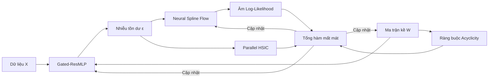

# CausalFlowNet: Một nghiên cứu nhỏ về khám phá cấu trúc nhân quả phi tuyến

<p align="center">
  
</p>

## 🌟 Giới thiệu / Introduction
**CausalFlowNet** là đồ án/dự án cá nhân của tôi nhằm tìm hiểu và thực nghiệm các phương pháp khám phá quan hệ nhân quả (Causal Discovery) trong môi trường dữ liệu phi tuyến tính. Dự án này kết hợp ý tưởng từ **Normalizing Flows** và **Mạng Neural** để thử nghiệm khả năng mô hình hóa nhiễu và xác định cấu trúc đồ thị nhân quả từ dữ liệu quan sát.

**CausalFlowNet** is my personal research project/thesis aimed at exploring and experimenting with causal discovery methods in nonlinear settings. This project combines ideas from **Normalizing Flows** and **Neural Networks** to test the ability to model noise and identify causal structures from observational data.

---

## 🚀 Các hướng tiếp cận chính / Key Approaches

Trong dự án này, tôi đã thử nghiệm và tích hợp một số kỹ thuật sau:
*   **Neural Spline Flows (NSF)**: Sử dụng để thử nghiệm việc học mật độ nhiễu mà không cần giả định phân phối Gauss cứng nhắc.
*   **Gated Residual MLP**: Một cấu trúc mạng nơ-ron đơn giản có thêm cơ chế cổng (Gating) để xử lý các tương tác phi tuyến.
*   **Parallel Fast HSIC**: Triển khai kiểm định độc lập thống kê song song bằng Random Fourier Features nhằm tối ưu tốc độ tính toán.
*   **Augmented Lagrangian**: Sử dụng khung tối ưu hóa liên tục để áp đặt ràng buộc đồ thị không chu trình (DAG).
*   **Ước lượng ATE**: Thử nghiệm tính toán hiệu ứng can thiệp trung bình dựa trên giả lập do-calculus.

---

## 🏗️ Kiến trúc mô hình / Architecture

Mô hình hoạt động theo một quy trình (pipeline) liên tục để tối ưu hóa đồng thời cấu trúc và các hàm cơ chế:



---

## 📊 Kết quả thực nghiệm / Experimental Results

Dưới đây là một số kết quả tôi đạt được khi chạy thử trên các tập dữ liệu benchmark (Sachs và SynTReN-20):

| Website/Dataset | TPR | FPR | FDR | SHD | SHD-c | SID |
| :--- | :---: | :---: | :---: | :---: | :---: | :---: |
| **Sachs** (11 nodes) | 0.44 | 0.06 | 0.43 | 12 | 16 | **37** |
| **SynTReN** (20 nodes) | 0.63 | 0.08 | 0.65 | 25 | 35 | 166 |

### Visual Comparisons / Trực quan hóa kết quả

#### 1. Sachs Dataset (Protein Signaling Network)
<p align="center">
  
  
  <br><i>Đồ thị nhân quả và Ma trận kề (Sachs)</i>
</p>

#### 2. SynTReN Dataset (Synthetic Regulatory Network)
<p align="center">
  
  
  <br><i>Đồ thị nhân quả và Ma trận kề (SynTReN)</i>
</p>


*Lưu ý: Các kết quả này phản ánh quá trình thực nghiệm cá nhân và có thể thay đổi tùy theo cách tinh chỉnh siêu tham số.*

---

## 📦 Cấu trúc thư mục / Structure

```text
├── core/               # logic tối ưu hóa & HSIC
├── modules/            # Các khối mạng Neural (MLP, Flow)
├── ultis/              # Công cụ đánh giá & Trực quan hóa

├── CausalFlowNet.py    # Lõi mô hình chính
├── test_sachs.py       # Thực nghiệm trên tập protein Sachs
└── test_syntren.py     # Thực nghiệm trên tập gene SynTReN
```

---

## 🛠️ Cách sử dụng / Usage

1. Cài đặt các thư viện cần thiết:
```bash
pip install torch numpy pandas networkx matplotlib seaborn scikit-learn
```

2. Chạy thử các kịch bản thực nghiệm:
```bash
# Thử nghiệm trên tập Sachs
python test_sachs.py

# Thử nghiệm trên tập SynTReN
python test_syntren.py
```

---

## 📜 Ghi nhận / Acknowledgements
Dự án này là một phần trong quá trình học tập và nghiên cứu của tôi tại **Trường Đại học Lạc Hồng (LHU)**. Tôi xin gửi lời cảm ơn đến giảng viên hướng dẫn của tôi nhằm hoàn thành nghiên cứu này.

This project is part of my learning and research journey at **Lac Hong University**. I would like to thank my supervisor for their support in completing this research.

---
**Copyright (c) 2026 ManhThai | Licensed under MIT License**