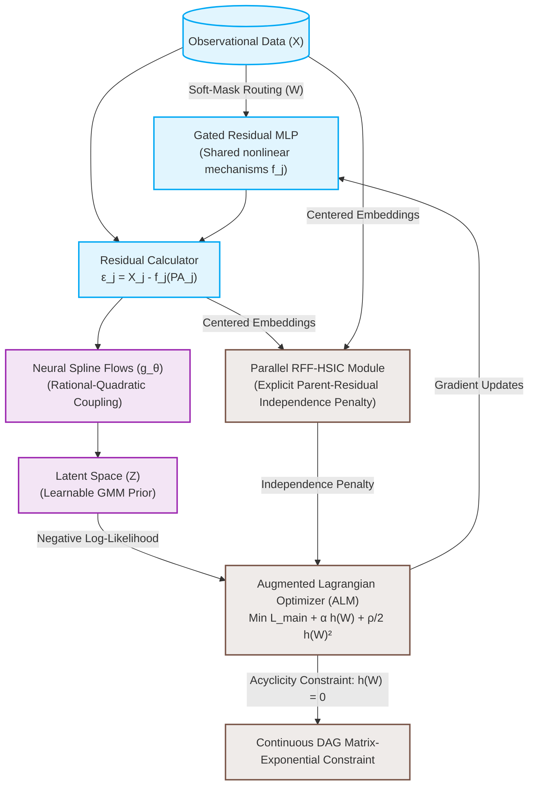

<h1 align="center">🧬 CausalFlowNet</h1>
<h3 align="center">Nonlinear Causal Discovery via Normalizing Flows and Parallel Independence Testing</h3>

<p align="center">
  <a href="LICENSE"></a>
  <a href="https://pytorch.org/"></a>
  <a href="https://www.python.org/"></a>
  <a href="https://developer.nvidia.com/cuda-toolkit"></a>
</p>

---

## 🌟 Introduction / Giới thiệu ngắn

**CausalFlowNet** is a state-of-the-art, end-to-end deep learning framework designed to discover continuous causal DAGs (Directed Acyclic Graphs) from observational data. Unlike traditional causal structure learning algorithms that rely on rigid parametric assumptions (such as linear Gaussian mechanisms), CausalFlowNet integrates highly flexible neural density estimators with an extremely fast parallelized independence penalty to model complex nonlinear systems.

> [!NOTE]
> **Giới thiệu bằng tiếng Việt:**  
> **CausalFlowNet** là một khung học sâu hợp nhất đầu-cuối giúp khám phá đồ thị cấu trúc nhân quả (DAG) liên tục từ dữ liệu quan sát. Khác với các mô hình truyền thống dựa trên các giả định nhiễu tuyến tính Gauss cứng nhắc, CausalFlowNet kết hợp bộ ước lượng mật độ nơ-ron Rational-Quadratic Spline linh hoạt và hàm phạt độc lập song song hóa siêu nhanh (RFF-HSIC) để giải quyết các hệ thống sinh học phi tuyến tính phức tạp một cách chính xác và hiệu quả nhất.

---

## 📖 Deep Dive & Scientific Paper / Đọc Bài báo Khoa học

For a mathematically rigorous breakdown of the formulas, mechanisms, and algorithms behind this framework, please refer to the fully detailed academic paper written in Vietnamese:

👉 **[Xem Bài báo Khoa học Chi tiết tại paper.md (Vietnamese)](file:///c:/Users/manht/Downloads/CausalFlowNet/paper.md)**

*This paper covers the exact formulations for Additive Noise Models, Neural Spline Flows (NSF), GMM Priors, Random Fourier Features (RFF) for $\mathcal{O}(d \cdot n \cdot m)$ HSIC estimation, and Augmented Lagrangian Method (ALM) constrained optimization.*

---

## 🛠️ System Architecture / Kiến trúc Hệ thống

CausalFlowNet models the Structural Equation Model (SEM) $X_j = f_j(\mathbf{PA}_j) + \varepsilon_j$ and explicitly enforces the Additive Noise Model (ANM) independence condition $\varepsilon_j \perp\!\!\!\perp \mathbf{PA}_j$ through the following modular pipeline:



---

## ✨ Core Features

*   **🧬 Arbitrary Nonlinear Mechanism Modeling**: Powered by a unified, shared **Gated Residual MLP (Gated-ResMLP)** utilizing soft-mask routing to regularize parameters and prevent overfitting.
*   **📈 Expressive Non-Gaussian Noise Estimation**: Leverages invertible **Neural Spline Flows (NSF)** with rational-quadratic splines and a learnable **Gaussian Mixture Model (GMM)** prior.
*   **⚡ Super-Fast Parallelized Independence Testing**: Employs **Random Fourier Features (RFF)** to approximate the RBF kernel, reducing HSIC complexity from $\mathcal{O}(d \cdot n^2)$ to $\mathcal{O}(d \cdot n \cdot m)$.
*   **🔗 Guaranteed Acyclicity**: Optimizes the weighted adjacency matrix under the continuous **NOTEARS** matrix exponential constraint via the **Augmented Lagrangian Method (ALM)**.
*   **📊 Causal Subgrouping & ATE Analysis**: Supports unsupervised clustering of structural states in the latent space and performs causal interventions ($do(X_s = v)$) to calculate **Average Treatment Effects (ATE)**.
*   **💻 Interactive UI Dashboard**: Includes a complete Flask backend with a beautiful frontend to dynamically run causal "what-if" simulations.

---

## 🚀 Step-by-Step Installation & Setup

### A. Prerequisites
*   Python $\geq 3.8$
*   CUDA Toolkit $\geq 11.3$ (Optional, for GPU acceleration)

### B. Setup Instructions
```bash
# 1. Clone the repository
git clone https://github.com/manhthai1706/CausalFlowNet.git
cd CausalFlowNet

# 2. Initialize a virtual environment
python -m venv venv
source venv/bin/activate  # On Windows use: .\venv\Scripts\activate

# 3. Install core dependencies
pip install -r requirements.txt
```

---

## 📈 Running Benchmarks

Evaluate the performance of CausalFlowNet on real-world and simulated networks:

### 1. Real Biological Data: Sachs Network
Reconstruct the intracellular signaling network of human T-cells ($d=11$ nodes, $n=7,466$ samples).
```bash
python test_sachs.py
```
*   **Runtime**: ~2 minutes on CPU.
*   **Outputs**: Reconstructed DAG network (`sachs_graph_comparison.png`) and continuous adjacency comparison matrices (`sachs_adjacency_comparison.png`).

### 2. Synthetic Data: SynTReN Network
Simulate non-linear gene regulatory networks in *E. coli* ($d=20$ nodes, $n=500$ samples).
```bash
python test_syntren.py
```
*   **Runtime**: ~5 minutes on CPU.
*   **Outputs**: Reconstructed gene regulatory network (`syntren_graph_comparison.png`) and adjacency comparison matrices (`syntren_adjacency_comparison.png`).

---

## 🖥️ Interactive Web Demo (What-If Simulations)

We provide an interactive **Flask Web Application** that acts as an analytical dashboard. You can perform real-time virtual interventions and study causal cascades!

<p align="center">
  <strong>Run the web interface locally:</strong>
</p>

```bash
# Start the Flask web application
python demo/app.py
```

1.  Open your browser and navigate to `http://127.0.0.1:5000`.
2.  **Visual Interaction**: Inspect the interactive causal graph dynamically.
3.  **Virtual Interventions**: Select any source node $X_s$, apply a virtual intervention value ($do(X_s = v)$), and watch downstream target node expectations update instantly via real-time forward passes through the trained nonlinear mechanism.

---

## 📊 Benchmark Results

Performance comparison of CausalFlowNet against standard baselines:

| Paradigm | Method | SHD (Sachs) ↓ | SHD-c (Sachs) ↓ | SID (Sachs) ↓ | SHD (Syn) ↓ | SHD-c (Syn) ↓ | SID (Syn) ↓ |
| :--- | :--- | :---: | :---: | :---: | :---: | :---: | :---: |
| **CB** | PC [11] | $17.0$ | $11.0$ | $47.0 \text{ to } 62.0$ | $41.0 \pm 5.1$ | $42.4 \pm 4.6$ | $154.8 \pm 47.6$ |
| **SB** | GES [2] | $26.0$ | $28.0$ | $34.0 \text{ to } 45.0$ | $82.6 \pm 9.3$ | $85.6 \pm 10.0$ | $157.2 \pm 48.3$ |
| **FCM** | CAM [7] | $12.0$ | **$9.0$** | $55.0$ | $40.5 \pm 6.8$ | $41.4 \pm 7.1$ | $152.3 \pm 48.0$ |
| **CO** | NOTEARS | $21.0$ | $21.0$ | $44.0$ | $151.8 \pm 28.2$ | $156.1 \pm 28.7$ | $110.7 \pm 66.7$ |
| **CO** | DAG-GNN | $16.0$ | $21.0$ | $44.0$ | $93.6 \pm 9.2$ | $97.6 \pm 10.3$ | $157.5 \pm 74.6$ |
| **CO** | GSF | $18.0$ | $10.0$ | $44.0 \text{ to } 61.0$ | $61.8 \pm 9.6$ | $63.3 \pm 11.4$ | **$76.7 \pm 51.1$** |
| **CO** | GraN-DAG | $13.0$ | $11.0$ | $47.0$ | $34.0 \pm 8.5$ | $36.4 \pm 8.3$ | $161.7 \pm 53.4$ |
| **CO** | **CausalFlowNet (Ours)** | **$12.0$** | $16.0$ | **$37.0$** | **$25.0$** | **$35.0$** | $166.0$ |

---

## 📊 Visual Diagnostics / Chẩn đoán Trực quan

Here are the reconstructed graphs and adjacency matrix comparisons generated by **CausalFlowNet**:

### 1. Sachs Protein Signaling Network (Real Biological Data)
<p align="center">
  
  
</p>

### 2. SynTReN Gene Expression Network (Synthetic Data)
<p align="center">
  
  
</p>

---

## 📁 Repository Structure

```
CausalFlowNet/
├── core/
│   ├── HSIC.py            # Fast parallel RFF-based HSIC module
│   └── Optimization.py    # Continuous acyclicity constraint & ALM solver
├── modules/
│   ├── MLP.py             # Gated Residual Block & Gated-ResMLP modeler
│   └── Flow.py            # Neural Spline Flow & learnable GMM prior
├── ultis/
│   ├── Evaluation.py      # Quantitative metrics (SHD, SID, TPR, FPR, FDR)
│   └── visualize.py       # DAG plotting and adjacency comparison tools
├── demo/                  # Interactive Flask web application
│   ├── app.py             # Backend server for real-time what-if simulations
│   ├── templates/         # HTML structure
│   └── static/            # CSS & JS styling assets
├── CausalFlowNet.py       # Main orchestrator (training pipeline, ATE, clustering)
├── test_sachs.py          # Sachs benchmark reproduction script
├── test_syntren.py        # SynTReN benchmark reproduction script
├── requirements.txt       # Core dependencies
├── paper.md               # Scientific research paper (Vietnamese)
└── LICENSE                # MIT License
```

---

## ✍️ Citation

If you find **CausalFlowNet** useful in your research or application, please cite our repository:

```bibtex
@software{tran2026causalflownet,
  author       = {Tran, Manh Thai},
  title        = {{CausalFlowNet}: Nonlinear Causal Discovery via Normalizing Flows and Parallel Independence Testing},
  year         = {2026},
  url          = {https://github.com/manhthai1706/CausalFlowNet},
  license      = {MIT}
}
```

---

## 📄 License

This project is licensed under the terms of the [MIT License](LICENSE).  
Copyright © 2026 Manh Thai Tran.
