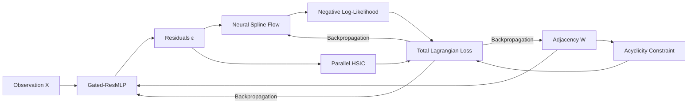
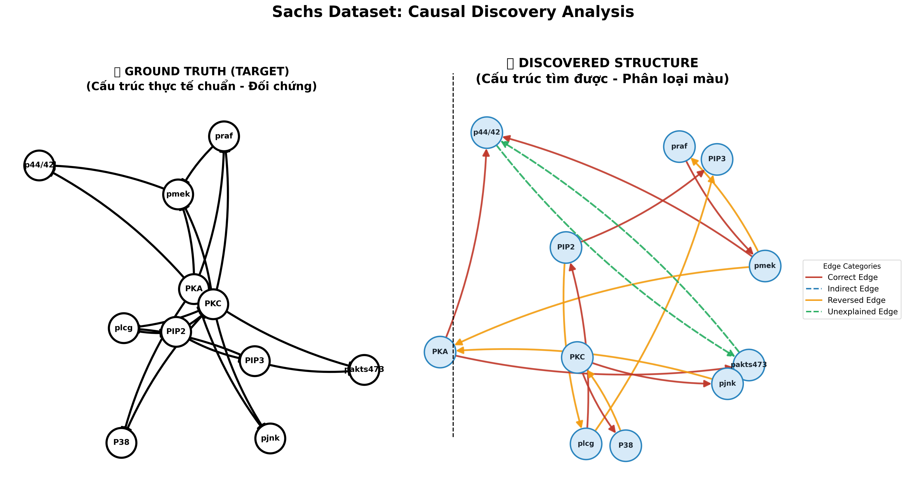
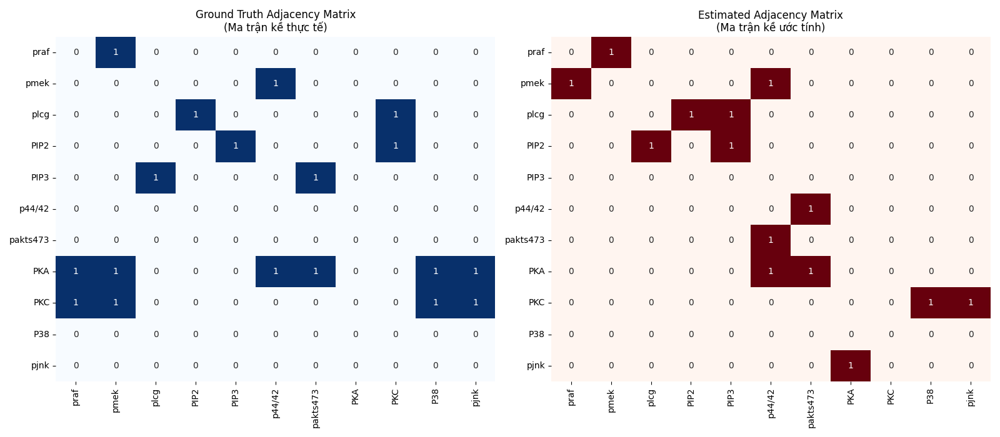
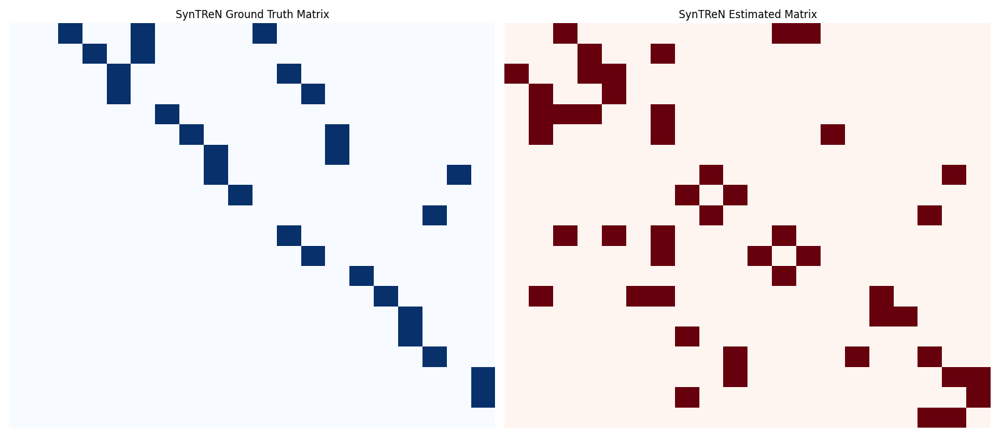

# CausalFlowNet: A Nonlinear Causal Discovery Framework via Normalizing Flows and Parallel Independence Testing

## Abstract
Causal discovery from continuous observational data remains a challenging task, particularly when the underlying mechanisms are highly nonlinear and subject to non-Gaussian noise. We introduce **CausalFlowNet**, a unified deep learning framework for continuous causal structure learning. The proposed architecture leverages a **Gated Residual Multi-Layer Perceptron (Gated-ResMLP)** to capture complex context-dependent interactions, alongside **Neural Spline Flows (NSF)** equipped with Gaussian Mixture Priors for flexible and exact density estimation of the residuals. To enforce the fundamental assumption of causal sufficiency—where noise residuals must be statistically independent of their causal parents—we introduce a fully parallelized **Hilbert-Schmidt Independence Criterion (HSIC)** module accelerated by Random Fourier Features. Optimized via the Augmented Lagrangian Method to strictly guarantee acyclicity, CausalFlowNet demonstrates highly competitive Structural Hamming Distance (SHD) and Structural Intervention Distance (SID) on both real biological datasets and synthetic regulatory networks.

---

## I. Introduction
The identification of Directed Acyclic Graphs (DAGs) from observational data is a cornerstone of empirical science. Traditional score-based and constraint-based methods often struggle with high-dimensional distributions and rely heavily on rigid parametric assumptions (e.g., linear Gaussian). CausalFlowNet frames causal discovery as a continuous constrained optimization problem. By relaxing the combinatorial search space into continuous weights and penalizing cyclic structures, our framework can scale efficiently while effectively handling complex nonlinear Additive Noise Models (ANMs).

---

## II. Proposed Architecture

The CausalFlowNet framework is composed of four highly integrated components designed to be trained end-to-end:

1. **Nonlinear Mechanism Modeler (Gated-ResMLP):** Models the structural equation function $f_i(PA_i)$ utilizing an advanced gating mechanism to handle diverse causal dependencies.
2. **Noise Density Estimator (Neural Spline Flows):** Eliminates the rigid Gaussian noise assumption by applying Rational-Quadratic Splines to map the observed residuals $\epsilon$ to a learnable Gaussian Mixture latent space, yielding exact Negative Log-Likelihood (NLL).
3. **Statistical Independence Verifier (Parallel HSIC):** A parallelized implementation of the Hilbert-Schmidt Independence Criterion (HSIC) using Random Fourier Features (RFF) to strongly penalize statistical dependence between causal parents and structural residuals with a time complexity of $\mathcal{O}(B \times m)$.
4. **DAG Constrained Optimization (Augmented Lagrangian):** Utilizes the matrix exponential trace formulation $h(W) = \text{Tr}(e^{W \circ W}) - d = 0$ embedded within an Augmented Lagrangian Method (ALM) loop to enforce strict acyclicity upon the learned weighted adjacency matrix.



---

## III. Experimental Results

We evaluate CausalFlowNet on two established benchmark datasets: the **Sachs** protein-signaling network (11 nodes) and the **SynTReN** synthetic regulatory network (20 nodes).

### A. Quantitative Evaluation

| Dataset | Variables ($d$) | TPR $\uparrow$ | FPR $\downarrow$ | FDR $\downarrow$ | SHD $\downarrow$ | SHD-c $\downarrow$ | SID $\downarrow$ |
| :--- | :---: | :---: | :---: | :---: | :---: | :---: | :---: |
| **Sachs** | 11 | 0.44 | 0.06 | 0.43 | 12 | 16 | **37** |
| **SynTReN**| 20 | 0.63 | 0.08 | 0.65 | 25 | 35 | 166 |

*Higher True Positive Rate (TPR) and lower False Positive Rate (FPR), False Discovery Rate (FDR), Structural Hamming Distance (SHD), and Structural Intervention Distance (SID) indicate better performance.*

### B. Visual Diagnostics

#### 1. Real Biological Data: Sachs Protein Network
<p align="center">
  
  
</p>

#### 2. Synthetic Data: SynTReN Gene Expression
<p align="center">
  
  
</p>

---

## IV. Conclusion
In this work, we present CausalFlowNet, a continuous causal structure learning framework. The integration of Spline-based flows with parallel independence testing offers substantial improvements in handling unknown noise distributions without relying on rigid parametric assumptions. Empirical benchmarking verifies its competitive capacity for identifying intricate biological graphs and recovering interventional causal distributions.

---

## V. Repository Structure & Reproduction

```text
├── core/               # Optimization & RFF-based HSIC formulations
├── modules/            # Feed-forward ANM mechanisms & Spline Flows
├── ultis/              # Graph evaluation metrics (SHD, SID) & Plotting
├── CausalFlowNet.py    # Main ALM loop & Model integration
├── test_sachs.py       # Evaluation script for Sachs dataset
└── test_syntren.py     # Evaluation script for SynTReN dataset
```

### Setup & Execution
**1. Environment Requirements:**
```bash
pip install -r requirements.txt
```

**2. Running Benchmarks:**
```bash
python test_sachs.py     # Execute on Protein Network
python test_syntren.py   # Execute on Gene Expression Network
```

---
**Disclaimer**: This project functions as an academic research study. Code is released strictly corresponding to the methodologies mentioned above.