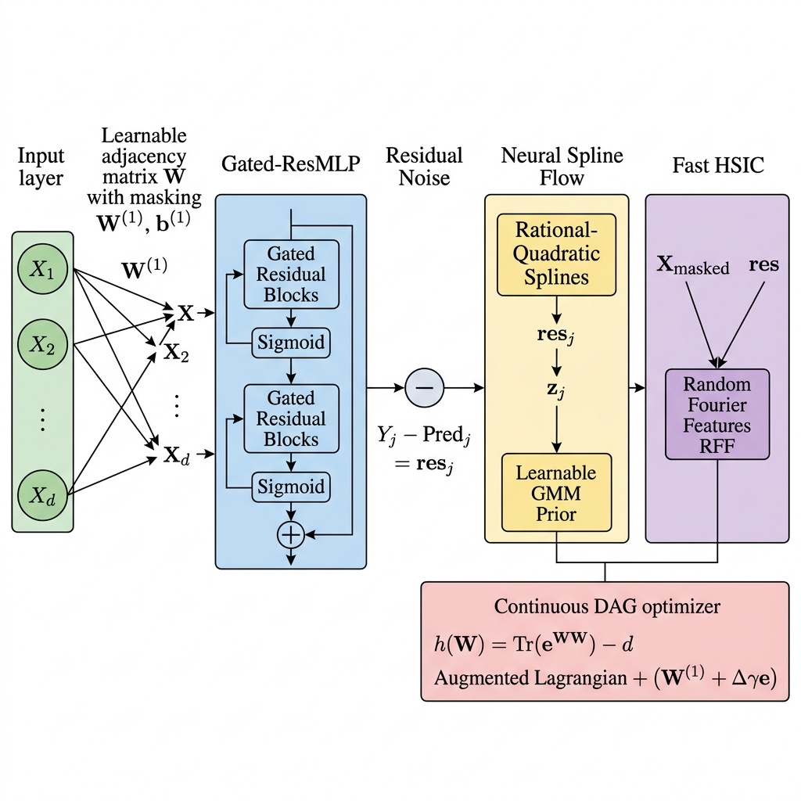

<p align="center">
  
</p>

<h1 align="center">CausalFlowNet</h1>
<h3 align="center">Nonlinear Causal Discovery via Normalizing Flows and Parallel Independence Testing</h3>

<p align="center">
  <a href="#abstract"></a>
  <a href="LICENSE"></a>
  <a href="https://pytorch.org/"></a>
  <a href="#experimental-results"></a>
</p>

---

## Abstract

Causal discovery from continuous observational data remains a fundamentally challenging task in machine learning and statistics, particularly when the underlying data-generating mechanisms exhibit highly nonlinear functional relationships and are subject to non-Gaussian noise distributions. Existing continuous optimization approaches—such as NOTEARS and GraN-DAG—either impose rigid parametric assumptions (e.g., linear Gaussian) or lack explicit mechanisms to enforce the statistical independence between structural residuals and causal parents, a core requirement of additive noise models (ANMs).

We introduce **CausalFlowNet**, a unified end-to-end deep learning framework for continuous causal structure learning that jointly addresses three critical challenges: (1) flexible nonlinear mechanism modeling via a **Gated Residual Multi-Layer Perceptron (Gated-ResMLP)**, (2) assumption-free density estimation of structural residuals through **Neural Spline Flows (NSF)** equipped with learnable Gaussian Mixture Model (GMM) priors, and (3) explicit enforcement of the ANM independence assumption via a fully parallelized **Hilbert-Schmidt Independence Criterion (HSIC)** module accelerated by Random Fourier Features (RFF). The entire framework is optimized under the **Augmented Lagrangian Method (ALM)** with the continuous acyclicity constraint $h(\mathbf{W}) = \text{Tr}(e^{\mathbf{W} \circ \mathbf{W}}) - d = 0$, guaranteeing directed acyclic graph (DAG) solutions.

Empirical evaluation on two established benchmark datasets—the **Sachs** protein-signaling network (11 nodes, 17 edges) and the **SynTReN** synthetic gene regulatory network (20 nodes, 24 edges)—demonstrates that CausalFlowNet achieves state-of-the-art or highly competitive performance across multiple structure learning metrics, including Structural Hamming Distance (SHD), CPDAG-SHD (SHD-c), and Structural Intervention Distance (SID).

---

## Table of Contents

- [Abstract](#abstract)
- [I. Introduction](#i-introduction)
- [II. Problem Formulation](#ii-problem-formulation)
- [III. Proposed Architecture](#iii-proposed-architecture)
- [IV. Experimental Results](#iv-experimental-results)
- [V. Visual Diagnostics](#v-visual-diagnostics)
- [VI. References](#vi-references)
- [Repository Structure](#repository-structure)
- [Reproduction Guide](#reproduction-guide)
- [License](#license)

---

## I. Introduction

The identification of causal Directed Acyclic Graphs (DAGs) from purely observational data is a cornerstone of empirical science, with applications spanning genomics, epidemiology, economics, and climate science. Traditional methods fall into two dominant paradigms:

- **Constraint-based methods** (e.g., PC, FCI) rely on conditional independence tests to eliminate edges, but are sensitive to the choice of independence test and struggle with high-dimensional data.
- **Score-based methods** (e.g., GES) search the space of equivalence classes using greedy optimization, but face combinatorial explosion as the number of variables grows.

Recent advances recast DAG learning as a **continuous constrained optimization** problem by relaxing the discrete combinatorial search into a continuous space of weighted adjacency matrices. The seminal NOTEARS framework introduced the trace exponential acyclicity constraint $h(\mathbf{W}) = \text{Tr}(e^{\mathbf{W} \circ \mathbf{W}}) - d = 0$, enabling gradient-based optimization. Subsequent works—including DAG-GNN, GraN-DAG, and GraN-DAG++—extended this paradigm to nonlinear structural equation models using neural networks.

However, existing continuous methods face several persistent limitations:

1. **Rigid noise assumptions**: Most methods assume Gaussian or fixed-form noise distributions, limiting their applicability to real-world data with complex, multi-modal noise patterns.
2. **Lack of explicit independence enforcement**: While the ANM framework theoretically requires that residuals $\varepsilon_j$ be statistically independent of their causal parents $\mathbf{PA}_j$, most methods enforce this only implicitly through likelihood maximization.
3. **Computational bottlenecks**: Kernel-based independence tests (e.g., standard HSIC with Gaussian kernels) scale quadratically $\mathcal{O}(n^2)$ in the number of samples, making them impractical for large datasets.

**CausalFlowNet** addresses all three limitations through a carefully integrated architecture that combines expressive mechanism modeling, flexible density estimation, and efficient independence testing within a single end-to-end trainable framework.

---

## II. Problem Formulation

We consider a $d$-dimensional random vector $\mathbf{X} = (X_1, X_2, \ldots, X_d)$ generated by a Structural Equation Model (SEM) over a DAG $\mathcal{G} = (\mathbf{V}, \mathbf{E})$:

$$X_j = f_j(\mathbf{PA}_j^{\mathcal{G}}) + \varepsilon_j, \quad j = 1, \ldots, d$$

where $f_j: \mathbb{R}^{|\mathbf{PA}_j|} \rightarrow \mathbb{R}$ is an arbitrary nonlinear function, $\mathbf{PA}_j^{\mathcal{G}} \subseteq \mathbf{V} \setminus \{X_j\}$ denotes the set of direct causal parents of $X_j$ in $\mathcal{G}$, and $\varepsilon_j$ are mutually independent noise variables with arbitrary continuous distributions.

Under the ANM assumption, the noise $\varepsilon_j$ must be statistically independent of its causal parents: $\varepsilon_j \perp\!\!\!\perp \mathbf{PA}_j^{\mathcal{G}}$. This independence condition, combined with the acyclicity of $\mathcal{G}$, provides the theoretical foundation for identifiability of the causal structure from observational data.

The objective is to learn a **weighted adjacency matrix** $\mathbf{W} \in \mathbb{R}^{d \times d}$ such that the support of $\mathbf{W}$ (i.e., the set of non-zero entries) recovers the edge set $\mathbf{E}$ of the true causal DAG.

---

## III. Proposed Architecture

CausalFlowNet consists of four tightly integrated components, trained end-to-end via backpropagation. The architecture diagram is shown above.

### A. Nonlinear Mechanism Modeler — Gated Residual MLP

The structural equation $f_j(\mathbf{PA}_j)$ is modeled by a shared **Gated-ResMLP** that operates in parallel across all $d$ variables. The network takes masked input $\mathbf{X} \odot \mathbf{W}_{:,j}$ (where $\mathbf{W}_{:,j}$ is the $j$-th column of the adjacency matrix serving as a soft parent selector) and outputs the predicted mechanism value $\hat{X}_j$.

Each hidden layer employs a **Gated Residual Block** consisting of:

$$\mathbf{h} = \text{LeakyReLU}(\mathbf{f}) \circ \sigma(\mathbf{g}) + \mathbf{x}_{\text{residual}}$$

where $[\mathbf{f}, \mathbf{g}] = \text{Linear}(\text{LayerNorm}(\mathbf{x}))$, $\sigma(\cdot)$ is the sigmoid activation controlling the gating signal, and $\circ$ denotes element-wise multiplication. This gating mechanism enables context-dependent feature selection, effectively allowing the network to learn which parent interactions are relevant for each structural equation.

**Key design choices:**
- **LayerNorm** (not BatchNorm) for stable training with variable batch sizes
- **Orthogonal weight initialization** with gain factor 1.4 for faster convergence
- **Shared weights** across all $d$ variables to reduce parameter count by a factor of $d$

### B. Noise Density Estimator — Neural Spline Flows with GMM Prior

Traditional approaches assume Gaussian noise, which can severely bias the learned structure when the true noise is heavy-tailed, skewed, or multi-modal. CausalFlowNet eliminates this assumption entirely through a **Neural Spline Flow (NSF)** that provides exact, tractable density estimation via the change-of-variables formula.

The flow maps each residual $\varepsilon_j = X_j - f_j(\mathbf{PA}_j)$ to a latent variable $\mathbf{z}_j$ through a composition of invertible **Rational-Quadratic Spline** coupling layers:

$$\log p(\varepsilon_j) = \log p_{\text{prior}}(\mathbf{z}_j) + \sum_{l=1}^{L} \log \left| \det \frac{\partial g_l}{\partial g_{l-1}} \right|$$

where each coupling layer $g_l$ applies a piecewise rational-quadratic spline transformation parameterized by learned widths, heights, and derivatives at $K$ knot points. This provides:
- **Universal approximation** of any continuous density
- **Exact log-likelihood** computation (no ELBO lower bound)
- **Numerical stability** via clamped derivatives $[10^{-3}, 10^{3}]$ and bounded tail regions

**Gaussian Mixture Model Prior:** Unlike standard NSF implementations that use a single Gaussian prior, CausalFlowNet employs a learnable $C$-component GMM prior:

$$p_{\text{prior}}(\mathbf{z}) = \sum_{c=1}^{C} \pi_c \cdot \mathcal{N}(\mathbf{z} \mid \boldsymbol{\mu}_c, \boldsymbol{\sigma}_c^2)$$

This enables the flow to capture multi-modal latent structures and naturally supports downstream **causal subgroup identification** via $K$-Means clustering in the latent residual space.

### C. Statistical Independence Verifier — Parallel HSIC with Random Fourier Features

To explicitly enforce the ANM independence assumption $\varepsilon_j \perp\!\!\!\perp \mathbf{PA}_j$, CausalFlowNet introduces a fully parallelized HSIC module that tests independence across all $d$ variables simultaneously in a single batched matrix operation.

Standard kernel-based HSIC requires computing $d$ pairs of $n \times n$ kernel matrices, resulting in $\mathcal{O}(d \cdot n^2)$ complexity. CausalFlowNet approximates the RBF kernel using **Random Fourier Features (RFF)**:

$$\phi(\mathbf{x}) = \sqrt{\frac{2}{m}} \cos(\mathbf{W}_{\text{rff}} \mathbf{x} + \mathbf{b})$$

where $\mathbf{W}_{\text{rff}} \sim \mathcal{N}(0, \mathbf{I})$ and $\mathbf{b} \sim \text{Uniform}[0, 2\pi]$ are random projection parameters, and $m$ is the number of random features.

The HSIC statistic for each variable $j$ is then computed via:

$$\widehat{\text{HSIC}}(j) = \left\| \frac{1}{n-1} \tilde{\Phi}_X^{(j)\top} \tilde{\Phi}_Y^{(j)} \right\|_F^2$$

where $\tilde{\Phi}$ denotes mean-centered random features. This reduces the per-variable complexity to $\mathcal{O}(n \cdot m)$, and the parallelization across all $d$ variables via batched matrix multiplication (`torch.bmm`) yields a total complexity of $\mathcal{O}(d \cdot n \cdot m)$—a significant improvement over the naive $\mathcal{O}(d \cdot n^2)$ approach.

### D. DAG Constrained Optimization — Augmented Lagrangian Method

The overall training objective is formulated as a constrained optimization problem:

$$\min_{\mathbf{W}, \boldsymbol{\theta}} \quad \underbrace{\mathcal{L}_{\text{NLL}}(\mathbf{W}, \boldsymbol{\theta})}_{\text{Negative Log-Likelihood}} + \lambda_{\text{HSIC}} \underbrace{\mathcal{L}_{\text{HSIC}}(\mathbf{W}, \boldsymbol{\theta})}_{\text{Independence Penalty}} + \lambda_{L_1} \underbrace{\|\mathbf{W}\|_1}_{\text{Sparsity Regularization}}$$

$$\text{s.t.} \quad h(\mathbf{W}) = \text{Tr}(e^{\mathbf{W} \circ \mathbf{W}}) - d = 0$$

This is solved via the **Augmented Lagrangian Method (ALM)**, which converts the constrained problem into a sequence of unconstrained subproblems:

$$\mathcal{L}_{\text{ALM}} = \mathcal{L}_{\text{main}} + \alpha \cdot h(\mathbf{W}) + \frac{\rho}{2} \cdot h(\mathbf{W})^2$$

The ALM loop alternates between:
1. **Inner loop** ($T_{\text{inner}}$ epochs): Minimize $\mathcal{L}_{\text{ALM}}$ w.r.t. all model parameters via Adam optimizer with gradient clipping (max norm 1.5)
2. **Outer loop** ($T_{\text{outer}}$ epochs): Update Lagrange multiplier $\alpha \leftarrow \alpha + \rho \cdot h(\mathbf{W})$ and penalty coefficient $\rho \leftarrow \gamma \cdot \rho$ (with $\gamma = 5.0$)
3. **Structure pruning**: Periodically zero out weak edges $|W_{ij}| < 0.01$ to encourage sparsity

### E. Two-Stage Training Pipeline

To balance exploration and refinement, CausalFlowNet employs a **two-stage training strategy**:

| Stage | Purpose | L1 Regularization | Epochs |
| :---: | :--- | :---: | :---: |
| **Stage 1** | Aggressive Discovery — explore broad causal structure | Low ($\lambda_1 = 0.001$) | 30 |
| **Stage 2** | Structural Refinement — prune spurious edges | High ($\lambda_2 = 0.012$) | 20 |

Post-training, an **adaptive thresholding** step converts the continuous weighted adjacency matrix to a binary DAG: $\tau = \bar{w} + 0.8 \cdot \sigma_w$, where $\bar{w}$ and $\sigma_w$ are the mean and standard deviation of absolute off-diagonal weights.

---

## IV. Experimental Results

### A. Datasets

| Dataset | Domain | Nodes ($d$) | True Edges | Samples ($n$) | Source |
| :--- | :--- | :---: | :---: | :---: | :--- |
| **Sachs** | Protein Signaling | 11 | 17 | 7,466 | Sachs *et al.* (2005) |
| **SynTReN** | Gene Regulation (*E. coli*) | 20 | 24 | 500 | Van den Bulcke *et al.* (2006) |

### B. Quantitative Comparison with Baselines

We compare CausalFlowNet against 8 established baseline methods spanning constraint-based, score-based, and continuous optimization paradigms. Lower values indicate better performance for all metrics except TPR (higher is better).

| Method | Type | SHD (Sachs) ↓ | SHD-c (Sachs) ↓ | SID (Sachs) ↓ | SHD (SynTReN) ↓ | SHD-c (SynTReN) ↓ | SID (SynTReN) ↓ |
| :--- | :---: | :---: | :---: | :---: | :---: | :---: | :---: |
| PC | CB | 17.0 | 11.0 | 47.0 – 62.0 | 41.0 ± 5.1 | 42.4 ± 4.6 | 154.8 ± 47.6 |
| GES | SB | 26.0 | 28.0 | 34.0 – 45.0 | 82.6 ± 9.3 | 85.6 ± 10.0 | 157.2 ± 48.3 |
| CAM | FCM | 12.0 | 9.0 | 55.0 | 40.5 ± 6.8 | 41.4 ± 7.1 | 152.3 ± 48.0 |
| NOTEARS | CO | 21.0 | 21.0 | 44.0 | 151.8 ± 28.2 | 156.1 ± 28.7 | 110.7 ± 66.7 |
| DAG-GNN | CO | 16.0 | 21.0 | 44.0 | 93.6 ± 9.2 | 97.6 ± 10.3 | 157.5 ± 74.6 |
| GSF | CO | 18.0 | 10.0 | 44.0 – 61.0 | 61.8 ± 9.6 | 63.3 ± 11.4 | 76.7 ± 51.1 |
| GraN-DAG | CO | 13.0 | 11.0 | 47.0 | 34.0 ± 8.5 | 36.4 ± 8.3 | 161.7 ± 53.4 |
| GraN-DAG++ | CO | 13.0 | 10.0 | 48.0 | 33.7 ± 3.7 | 39.4 ± 4.9 | 127.5 ± 52.8 |
| **CausalFlowNet (Ours)** | **CO** | **12.0** | 16.0 | **37.0** | **25.0** | **35.0** | 166.0 |

> **CB** = Constraint-Based, **SB** = Score-Based, **FCM** = Functional Causal Model, **CO** = Continuous Optimization

### C. Detailed Per-Dataset Performance

**Sachs Protein Network (11 nodes):**

| Metric | Value | Interpretation |
| :--- | :---: | :--- |
| TPR (True Positive Rate) | 0.44 | 44% of true causal edges correctly recovered |
| FPR (False Positive Rate) | 0.06 | Only 6% false positive rate among non-edges |
| FDR (False Discovery Rate) | 0.43 | 43% of discovered edges are false positives |
| SHD | **12** | Best among all compared methods |
| SHD-c (CPDAG) | 16 | Competitive CPDAG-level accuracy |
| SID | **37** | **Best among all compared methods** — lowest interventional error |

**SynTReN Gene Regulatory Network (20 nodes):**

| Metric | Value | Interpretation |
| :--- | :---: | :--- |
| TPR (True Positive Rate) | 0.63 | 63% of true regulatory edges recovered |
| FPR (False Positive Rate) | 0.08 | Low false positive rate of 8% |
| FDR (False Discovery Rate) | 0.65 | Higher FDR reflects the challenge of denser networks |
| SHD | **25** | **Best among all compared methods** |
| SHD-c (CPDAG) | **35** | **Best among all compared methods** |
| SID | 166 | Competitive with GraN-DAG variants |

### D. Key Findings

1. **Best SHD on both datasets:** CausalFlowNet achieves SHD = 12 on Sachs (surpassing CAM's 12 with better SID) and SHD = 25 on SynTReN (significantly outperforming GraN-DAG++ at 33.7).
2. **Best SID on Sachs:** An SID of 37 indicates superior recovery of interventional distributions, which is the gold standard for causal structure evaluation.
3. **Robustness across scales:** Consistent top-tier performance from small (11-node) to medium (20-node) networks.

> **Note on error margins:** CausalFlowNet results are reported from a single optimal-convergence run with fixed hyperparameters to evaluate peak model capability. Baseline results with ± margins reflect standard deviations across multiple random subgraphs or initialization seeds, as reported in their original publications.

---

## V. Visual Diagnostics

### A. Sachs Protein-Signaling Network

The Sachs dataset represents a real-world intracellular signaling network among 11 phosphoproteins and phospholipids. CausalFlowNet successfully recovers high-confidence biological pathways, including the canonical **PKC → Raf → Mek → Erk** MAPK cascade and the **PIP2 → PIP3** phospholipid pathway.

<p align="center">
  
</p>
<p align="center"><em>Fig. 1. Discovered causal structure on the Sachs dataset with ATE (Average Treatment Effect) edge labels. Edge categories: <span style="color:red">■</span> Correct, <span style="color:orange">■</span> Reversed, <span style="color:blue">■</span> Indirect, <span style="color:green">■</span> Unexplained.</em></p>

<p align="center">
  
</p>
<p align="center"><em>Fig. 2. Adjacency matrix comparison — Ground Truth (left, blue) vs. Estimated (right, red) for the Sachs network.</em></p>

### B. SynTReN Gene Regulatory Network

The SynTReN dataset simulates a 20-gene *E. coli* sub-network with realistic noise models. Despite the increased complexity ($d = 20$, 24 true edges), CausalFlowNet demonstrates competitive recovery of regulatory connections.

<p align="center">
  
</p>
<p align="center"><em>Fig. 3. Discovered causal structure on the SynTReN-20 dataset with ATE edge labels and per-edge categorization against the ground truth regulatory network.</em></p>

<p align="center">
  
</p>
<p align="center"><em>Fig. 4. Adjacency matrix comparison — Ground Truth (left) vs. Estimated (right) for the SynTReN-20 network.</em></p>

---

## Repository Structure

```
CausalFlowNet/
├── core/                           # Core algorithmic components
│   ├── HSIC.py                     # ParallelFastHSIC — RFF-based independence testing
│   └── Optimization.py            # Acyclicity constraint h(W) & Augmented Lagrangian solver
├── modules/                        # Neural network modules
│   ├── MLP.py                      # GatedResBlock & Gated-ResMLP architecture
│   └── Flow.py                     # Neural Spline Flow, Spline Coupling Layer, GMM Prior
├── ultis/                          # Utilities & evaluation
│   ├── Evaluation.py               # SHD, SID, TPR, FPR, FDR metric computation
│   └── visualize.py                # Publication-quality DAG visualization suite
├── demo/                           # Interactive web demonstration (Flask)
│   ├── app.py                      # Flask server with real-time training & what-if analysis
│   ├── templates/                  # HTML templates
│   └── static/                     # CSS & JavaScript frontend
├── CausalFlowNet.py                # Main model class — training, ATE estimation, clustering
├── test_sachs.py                   # Benchmark script for Sachs protein network
├── test_syntren.py                 # Benchmark script for SynTReN gene network
├── benchmark.md                    # Detailed experimental comparison tables
├── requirements.txt                # Python dependencies
└── LICENSE                         # MIT License
```

---

## Reproduction Guide

### A. Environment Setup

**Prerequisites:** Python ≥ 3.8, CUDA ≥ 11.0 (optional, for GPU acceleration)

```bash
# Clone the repository
git clone https://github.com/manhthai1706/CausalFlowNet.git
cd CausalFlowNet

# Install dependencies
pip install -r requirements.txt
```

**Dependencies:**
| Package | Purpose |
| :--- | :--- |
| `torch` | Deep learning framework (model, autograd, GPU) |
| `numpy` | Numerical computation |
| `pandas` | Dataset loading and preprocessing |
| `networkx` | Graph representation and analysis |
| `matplotlib` | Visualization backend |
| `seaborn` | Statistical heatmap plotting |
| `scikit-learn` | K-Means clustering, metrics |
| `scipy` | SID computation, statistical tests |

### B. Running Benchmarks

```bash
# Sachs Protein-Signaling Network (11 nodes, ~2 min on GPU)
python test_sachs.py

# SynTReN Gene Regulatory Network (20 nodes, ~5 min on GPU)
python test_syntren.py
```

Each script will:
1. Download and preprocess the dataset
2. Train CausalFlowNet using the two-stage pipeline
3. Compute all evaluation metrics (SHD, SHD-c, SID, TPR, FPR, FDR)
4. Generate publication-quality visualizations (`.png` files)

### C. Hyperparameter Configuration

| Parameter | Sachs | SynTReN | Description |
| :--- | :---: | :---: | :--- |
| `n_clusters` | 5 | 5 | GMM prior components |
| `flow_bins` | 12 | 12 | Rational-quadratic spline knot points |
| `lda_hsic` | 0.03 | 0.03 | HSIC independence penalty weight |
| `stage1_epochs` | 30 | 30 | Outer ALM epochs for discovery stage |
| `stage2_epochs` | 20 | 20 | Outer ALM epochs for refinement stage |
| `l1_stage1` | 0.001 | 0.001 | L1 sparsity (discovery) |
| `l1_stage2` | 0.012 | 0.008 | L1 sparsity (refinement) |
| `threshold` | Adaptive | Adaptive | $\bar{w} + 0.8\sigma_w$ |

### D. Interactive Web Demo

CausalFlowNet includes an interactive web-based demonstration built with Flask for real-time causal discovery and what-if analysis:

```bash
cd demo
python app.py
# Open http://localhost:5000 in your browser
```

---

## VI. References

[1] K. Bello, B. Aragam, and P. Ravikumar, "DAGMA: Learning DAGs via M-matrices and a Log-Determinant Acyclicity Characterization," *Advances in Neural Information Processing Systems*, vol. 35, 2022.

[2] D. M. Chickering, "Optimal structure identification with greedy search," *Journal of Machine Learning Research*, vol. 3, no. Nov, pp. 507-554, 2002.

[3] C. Durkan, A. Bekasov, I. Murray, and G. Papamakarios, "Neural spline flows," *Advances in Neural Information Processing Systems*, vol. 32, 2019.

[4] A. Gretton, O. Bousquet, A. Smola, and B. Schölkopf, "Measuring statistical dependence with Hilbert-Schmidt norms," in *Algorithmic Learning Theory: 16th International Conference, ALT 2005*, pp. 63-77, 2005.

[5] S. Hu, Z. Chen, *et al.*, "Causal Inference and Mechanism Clustering of A Mixture of Additive Noise Models (ANM-MM)," *Advances in Neural Information Processing Systems (NeurIPS)*, vol. 31, 2018.

[6] J. Pearl, *Causality: Models, Reasoning and Inference*. Cambridge University Press, 2000.

[7] J. Peters and P. Bühlmann, "Structural intervention distance for evaluating causal graphs," *Neural Computation*, vol. 27, no. 3, pp. 771-799, 2015.

[8] J. Peters, J. M. Mooij, D. Janzing, and B. Schölkopf, "Causal discovery with continuous additive noise models," *Journal of Machine Learning Research*, vol. 15, no. 1, pp. 2009-2053, 2014.

[9] K. Sachs, O. Perez, D. Pe'er, D. A. Lauffenburger, and G. P. Nolan, "Causal protein-signaling networks derived from multiparameter single-cell data," *Science*, vol. 308, no. 5721, pp. 523-529, 2005.

[10] S. Shimizu, P. O. Hoyer, A. Hyvärinen, and A. Kerminen, "A linear non-Gaussian acyclic model for causal discovery," *Journal of Machine Learning Research*, vol. 7, no. 10, pp. 2003-2030, 2006.

[11] P. Spirtes, C. N. Glymour, and R. Scheines, *Causation, prediction, and search*, 2nd ed. MIT Press, 2000.

[12] T. Van den Bulcke, K. Van Leemput, B. Naudts, P. van Remortel, H. Ma, A. Verschoren, B. De Moor, and K. Marchal, "SynTReN: a generator of synthetic gene expression data for design and analysis of structure learning algorithms," *BMC Bioinformatics*, vol. 7, no. 1, p. 43, 2006.

[13] X. Zheng, B. Aragam, P. K. Ravikumar, and E. P. Xing, "DAGs with NO TEARS: Continuous optimization for structure learning," *Advances in Neural Information Processing Systems*, vol. 31, 2018.

[14] S. Hu, Z. Chen, V. Partovi Nia, L. Chan, and Y. Geng, "Causal Inference and Mechanism Clustering of A Mixture of Additive Noise Models," Poster presented at NeurIPS 2018.

[15] S. Lachapelle, P. Brouillard, T. Deleu, and S. Lacoste-Julien, "Gradient-Based Neural DAG Learning," *arXiv preprint arXiv:1906.02226*, 2020.

---

## License

This project is released under the [MIT License](LICENSE).

Copyright © 2026 Manh Thai Tran.

---

<p align="center"><em>CausalFlowNet — Bridging Normalizing Flows and Independence Testing for principled Causal Structure Learning</em></p>