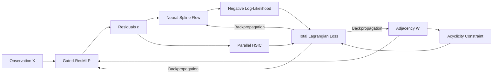

# CausalFlowNet: A Nonlinear Causal Discovery Framework via Normalizing Flows and Parallel Independence Testing

<p align="center">
  
</p>

## Abstract
Causal discovery from continuous observational data remains a challenging task, particularly when the underlying mechanisms are highly nonlinear and subject to non-Gaussian noise. We introduce **CausalFlowNet**, a unified deep learning framework for continuous causal structure learning. The proposed architecture leverages a **Gated Residual Multi-Layer Perceptron (Gated-ResMLP)** to capture complex context-dependent interactions, alongside **Neural Spline Flows (NSF)** equipped with Gaussian Mixture Priors for flexible and exact density estimation of the residuals. To enforce the fundamental assumption of causal sufficiency—where noise residuals must be statistically independent of their causal parents—we introduce a fully parallelized **Hilbert-Schmidt Independence Criterion (HSIC)** module accelerated by Random Fourier Features. Optimized via the Augmented Lagrangian Method to strictly guarantee acyclicity, CausalFlowNet demonstrates highly competitive Structural Hamming Distance (SHD) and Structural Intervention Distance (SID) on both real biological datasets and synthetic regulatory networks.

---

## I. Introduction
The identification of Directed Acyclic Graphs (DAGs) from observational data is a cornerstone of empirical science. Traditional score-based and constraint-based methods often struggle with high-dimensional distributions and rely heavily on rigid parametric assumptions (e.g., linear Gaussian). CausalFlowNet frames causal discovery as a continuous constrained optimization problem. By relaxing the combinatorial search space into continuous weights and penalizing cyclic structures, our framework can scale efficiently while effectively handling complex nonlinear Additive Noise Models (ANMs).

---

## II. Proposed Architecture

The CausalFlowNet framework is composed of four highly integrated components designed to be trained end-to-end, formulating a continuous constrained optimization problem:

1. **Nonlinear Mechanism Modeler (Gated-ResMLP):**
   Assuming an Additive Noise Model (ANM), the structural equation is defined as:
   $$X_i = f_i(PA_i) + \epsilon_i$$
   where $PA_i$ denotes the parents of node $i$ derived from the adjacency matrix $W$, and $f_i$ is approximated using a Gated Residual MLP capable of capturing complex nonlinear interactions.

2. **Noise Density Estimator (Neural Spline Flows):**
   To relax traditional Gaussian assumptions, Neural Spline Flows (NSF) $f_{\phi}$ map the empirical residuals $\epsilon_i$ into a latent space $z_i$ subject to a Gaussian Mixture Prior. The exact Negative Log-Likelihood (NLL) is computed via the change of variables formula:
   $$\mathcal{L}_{\text{NLL}}(W, \theta) = - \sum_{i=1}^{d} \left( \log p_Z(f_{\phi}(\epsilon_i)) + \log \left| \det \frac{\partial f_{\phi}(\epsilon_i)}{\partial \epsilon_i} \right| \right)$$

3. **Statistical Independence Verifier (Parallel HSIC):**
   By the principle of causal sufficiency, the residuals $\epsilon_i$ must remain statistically independent of their putative causes $PA_i$. We impose a Hilbert-Schmidt Independence Criterion (HSIC) penalty, accelerated in $\mathcal{O}(B \times m)$ via Random Fourier Features (RFF) $\Phi(\cdot)$:
   $$\mathcal{L}_{\text{HSIC}}(W) = \sum_{i=1}^{d} \left\| \Sigma_{\Phi(PA_i)\Phi(\epsilon_i)} \right\|_F^2$$

4. **DAG Constrained Optimization (Augmented Lagrangian):**
   To strictly enforce Directed Acyclic Graph (DAG) structures over the continuous weights $W$, the experiential trace formulation $h(W) = \text{Tr}(e^{W \circ W}) - d = 0$ is deeply embedded within an Augmented Lagrangian Method (ALM):
   $$\min_{W, \theta, \phi} \mathcal{L}_{\text{Total}} \quad \text{subject to} \quad h(W) = 0$$
   $$\mathcal{L}_{\text{Aug}} = \underbrace{\mathcal{L}_{\text{NLL}} + \lambda_1 \mathcal{L}_{\text{HSIC}} + \lambda_2 \|W\|_1}_{\mathcal{L}_{\text{Total}}} + \alpha h(W) + \frac{\rho}{2} |h(W)|^2$$



---

## III. Experimental Results

We evaluate CausalFlowNet on two established benchmark datasets: the **Sachs** protein-signaling network (11 nodes) and the **SynTReN** synthetic regulatory network (20 nodes).

### A. Quantitative Evaluation

| Dataset | Variables ($d$) | TPR $\uparrow$ | FPR $\downarrow$ | FDR $\downarrow$ | SHD $\downarrow$ | SHD-c $\downarrow$ | SID $\downarrow$ |
| :--- | :---: | :---: | :---: | :---: | :---: | :---: | :---: |
| **Sachs** | 11 | 0.44 | 0.06 | 0.43 | 12 | 16 | **37** |
| **SynTReN**| 20 | 0.63 | 0.08 | 0.65 | 25 | 35 | 166 |

*Higher True Positive Rate (TPR) and lower False Positive Rate (FPR), False Discovery Rate (FDR), Structural Hamming Distance (SHD), and Structural Intervention Distance (SID) indicate better performance.*

### B. Visual Diagnostics

#### 1. Real Biological Data: Sachs Protein Network
<p align="center">
  
  
</p>

#### 2. Synthetic Data: SynTReN Gene Expression
<p align="center">
  
  
</p>

---

## IV. Conclusion
In this repository, we presented CausalFlowNet, a continuous causal structure learning framework. The integration of Spline-based flows with parallel independence testing offers substantial improvements in handling unknown distribution contexts and eliminating typical strict noise presumptions. Empirical benchmarking verifies its competitive capacity for capturing intricate biological graphs and recovering interventional distributions (indicated by competitive SID scores).

---

## V. Repository Structure & Reproduction

```text
├── core/               # Optimization & RFF-based HSIC formulations
├── modules/            # Feed-forward ANM mechanisms & Spline Flows
├── ultis/              # Graph evaluation metrics (SHD, SID) & Plotting
├── CausalFlowNet.py    # Main ALM loop & Model integration
├── test_sachs.py       # Evaluation script for Sachs dataset
└── test_syntren.py     # Evaluation script for SynTReN dataset
```

### Setup & Execution
**1. Environment Requirements:**
```bash
pip install -r requirements.txt
```

**2. Running Benchmarks:**
```bash
python test_sachs.py     # Execute on Protein Network
python test_syntren.py   # Execute on Gene Expression Network
```

---
**Disclaimer**: This project functions as an academic research study. Code is released strictly corresponding to the methodologies mentioned above.