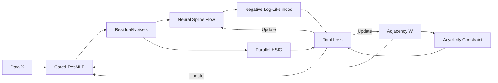

# CausalFlowNet: A Personal Study on Nonlinear Causal Discovery

<p align="center">
  
</p>

## 🌟 Introduction
**CausalFlowNet** is a personal research project aimed at exploring and experimenting with causal discovery methods in nonlinear settings. This project combines ideas from **Normalizing Flows** and **Neural Networks** to test the ability to model noise and identify causal structures from observational data.

---

## 🚀 Key Approaches

In this project, I have experimented with and integrated several techniques:
*   **Neural Spline Flows (NSF)**: Used to experiment with learning noise density without rigid Gaussian assumptions.
*   **Gated Residual MLP**: A neural network structure with a gating mechanism to handle nonlinear interactions.
*   **Parallel Fast HSIC**: Implementation of parallel statistical independence testing using Random Fourier Features (RFF) to optimize computation speed.
*   **Augmented Lagrangian**: A continuous optimization framework used to enforce Directed Acyclic Graph (DAG) constraints.
*   **ATE Estimation**: Initial experiments in calculating Average Treatment Effects based on do-calculus simulations.

---

## 🏗️ Architecture

The model operates through an end-to-end differentiable pipeline to simultaneously optimize both the graph structure and the mechanism functions:



---

## 📊 Experimental Results

Here are the results achieved during testing on standard benchmarks (Sachs and SynTReN-20):

| Dataset | TPR | FPR | FDR | SHD | SHD-c | SID |
| :--- | :---: | :---: | :---: | :---: | :---: | :---: |
| **Sachs** (11 nodes) | 0.44 | 0.06 | 0.43 | 12 | 16 | **37** |
| **SynTReN** (20 nodes) | 0.63 | 0.08 | 0.65 | 25 | 35 | 166 |

### Visual Comparisons

#### 1. Sachs Dataset (Protein Signaling Network)
<p align="center">
  
  
  <br><i>Causal Graph and Adjacency Matrix (Sachs)</i>
</p>

#### 2. SynTReN Dataset (Synthetic Regulatory Network)
<p align="center">
  
  
  <br><i>Causal Graph and Adjacency Matrix (SynTReN)</i>
</p>

*Note: These results reflect personal experimentation and may vary depending on hyperparameter tuning.*

---

## 📦 Structure

```text
├── core/               # Optimization & HSIC logic
├── modules/            # Neural network blocks (MLP, Flow)
├── ultis/              # Evaluation & Visualization tools
├── CausalFlowNet.py    # Main model engine
├── test_sachs.py       # Experiment on Sachs protein dataset
└── test_syntren.py     # Experiment on SynTReN gene dataset
```

---

## 🛠️ Usage

1. Install requirements:
```bash
pip install torch numpy pandas networkx matplotlib seaborn scikit-learn
```

2. Run testing scripts:
```bash
# Test on Sachs dataset
python test_sachs.py

# Test on SynTReN dataset
python test_syntren.py
```

---
**Copyright (c) 2026 ManhThai | Licensed under MIT License**