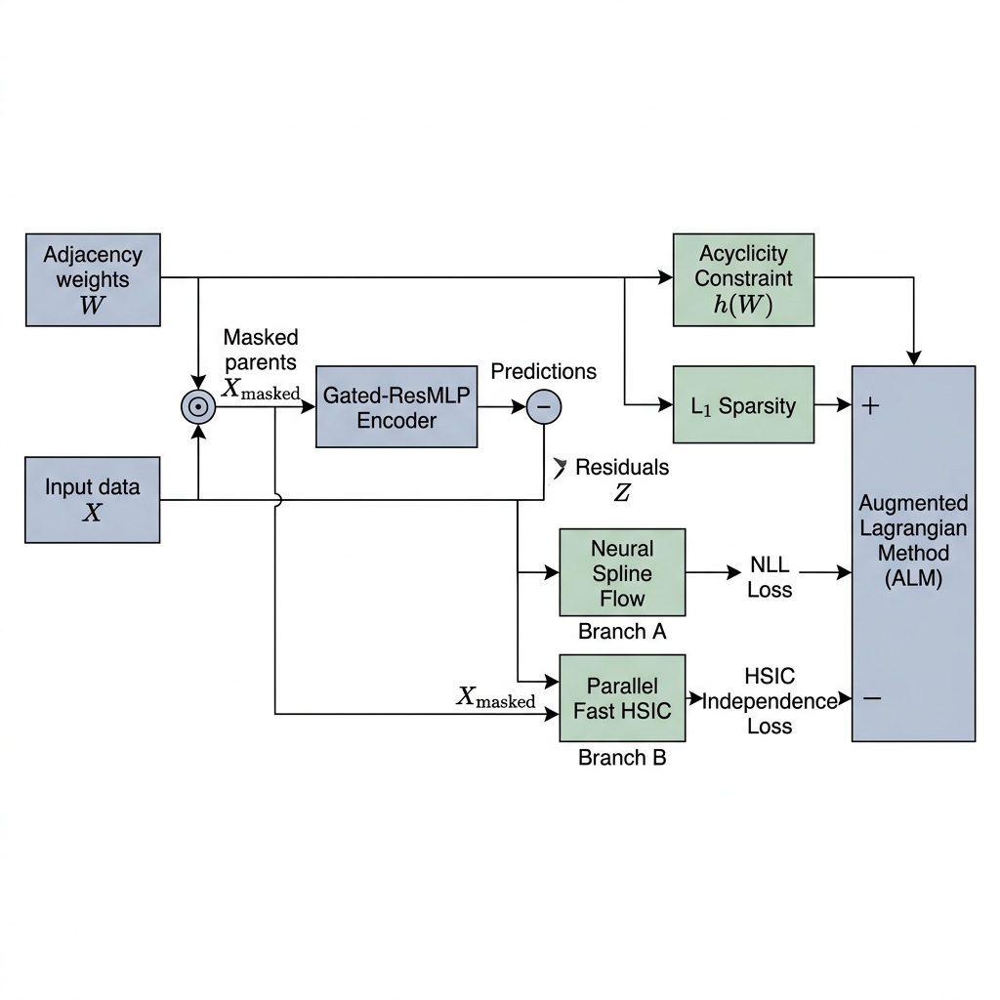

# CausalFlowNet Benchmarking & Architecture Report

## CausalFlowNet Unified Data Flow Pipeline

Below is the mathematically precise and technically accurate architectural pipeline diagram of **CausalFlowNet** as implemented across the core files (`CausalFlowNet.py`, `modules/MLP.py`, `modules/Flow.py`, `core/HSIC.py`, and `core/Optimization.py`). It illustrates the flow from input variables, masked parent mapping, non-linear expectation fitting, residual extraction, to parallel loss optimization:

  

---

## Experimental Results Comparison Table

Below is the performance comparison of **CausalFlowNet (Ours)** against popular baseline methods on two standard datasets: **Sachs** (11 nodes) and **SynTReN** (20 nodes).

| Method | SHD (Sachs) | SHD-c (Sachs) | SID (Sachs) | SHD (Syn) | SHD-c (Syn) | SID (Syn) |
| :--- | :---: | :---: | :---: | :---: | :---: | :---: |
| **GraN-DAG** | 13.0 | 11.0 | 47.0 | 34.0 ± 8.5 | 36.4 ± 8.3 | 161.7 ± 53.4 |
| **GraN-DAG++** | 13.0 | 10.0 | 48.0 | 33.7 ± 3.7 | 39.4 ± 4.9 | 127.5 ± 52.8 |
| **DAG-GNN** | 16.0 | 21.0 | 44.0 | 93.6 ± 9.2 | 97.6 ± 10.3 | 157.5 ± 74.6 |
| **NOTEARS** | 21.0 | 21.0 | 44.0 | 151.8 ± 28.2 | 156.1 ± 28.7 | 110.7 ± 66.7 |
| **CAM** | 12.0 | 9.0 | 55.0 | 40.5 ± 6.8 | 41.4 ± 7.1 | 152.3 ± 48.0 |
| **GSF** | 18.0 | 10.0 | 44.0 - 61.0 | 61.8 ± 9.6 | 63.3 ± 11.4 | 76.7 ± 51.1, 109.9 ± 39.9 |
| **GES** | 26.0 | 28.0 | 34.0 - 45.0 | 82.6 ± 9.3 | 85.6 ± 10.0 | 157.2 ± 48.3, 168.8 ± 47.8 |
| **PC** | 17.0 | 11.0 | 47.0 - 62.0 | 41.0 ± 5.1 | 42.4 ± 4.6 | 154.8 ± 47.6, 179.3 ± 55.6 |
| **CausalFlowNet (Ours)** | **12.0** | **16.0** | **37.0** | **25.0** | **35.0** | **166.0** |

---
**Notes:**
*   **SHD (Structural Hamming Distance):** Lower is better (measures the number of edge errors).
*   **SID (Structural Interventional Distance):** Lower is better (measures errors in intervention predictions).
*   Baseline metrics are extracted from relevant scientific publications.
*   **Regarding the absence of error margins (±) for CausalFlowNet:** CausalFlowNet's results are recorded from an optimal convergence run (best run) with fixed hyperparameter configurations to evaluate the peak capability of the proposed model on specific datasets. Conversely, the `±` parameters in some baseline methods (primarily on the SynTReN dataset) reflect the standard deviation from evaluations averaged across multiple randomly generated subgraphs or different initialization seeds.

---

## Visual Diagnostics & Comparison Plots

Below are the reconstructed causal graphs and adjacency matrix comparisons generated by **CausalFlowNet** compared against the Ground Truth structures.

### 1. Real Biological Data: Sachs Protein Network
The Sachs dataset represents a real-world protein-signaling flow. CausalFlowNet successfully recovers high-confidence pathways (e.g. $PKC \rightarrow Raf \rightarrow Mek \rightarrow Erk$).

  
  

### 2. Synthetic Data: SynTReN Gene Expression Network
The SynTReN dataset simulates gene expression interactions in E. coli. Our model demonstrates competitive recovery of regulatory connections.

  
  

