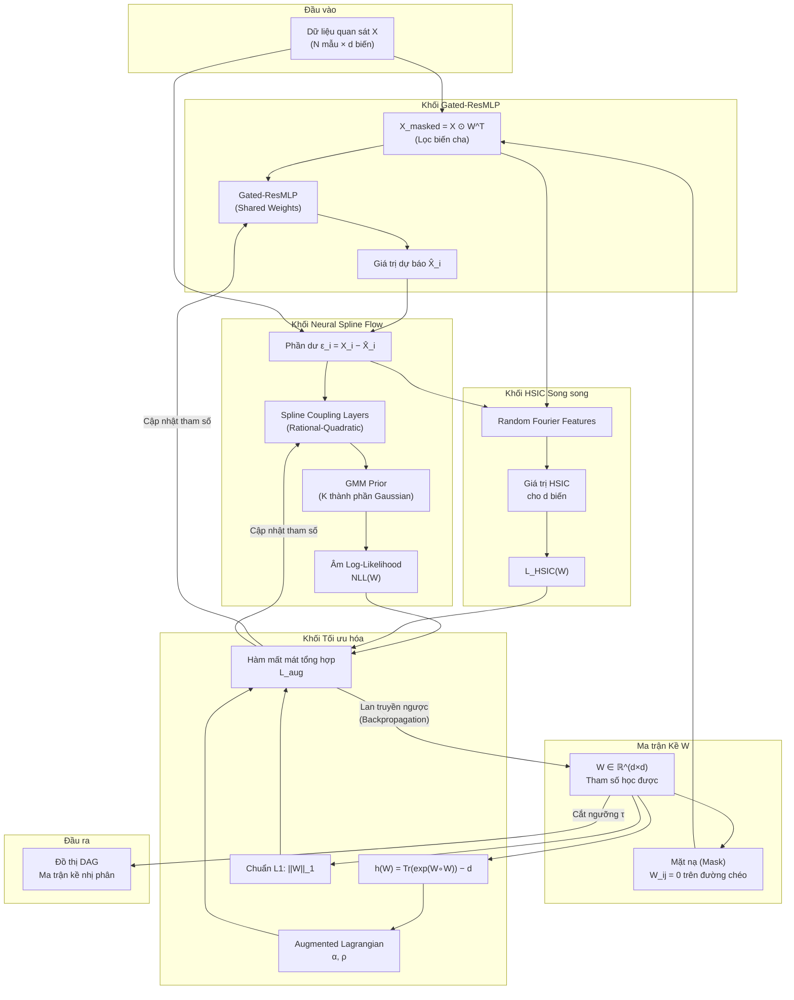
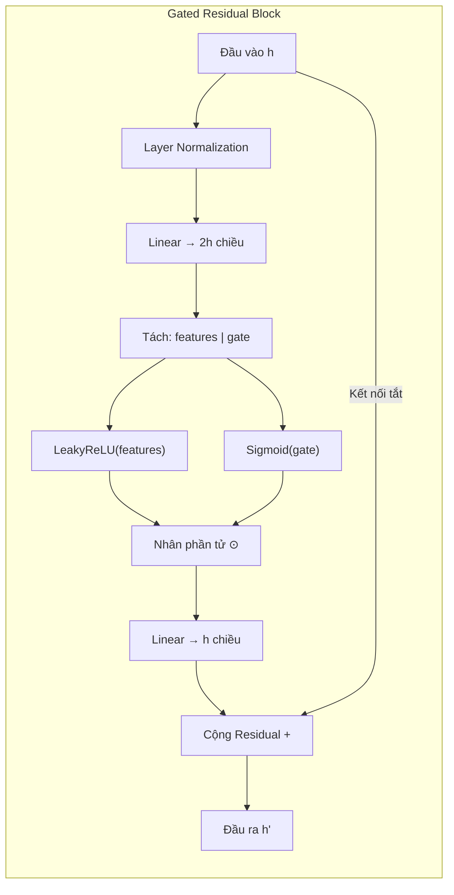
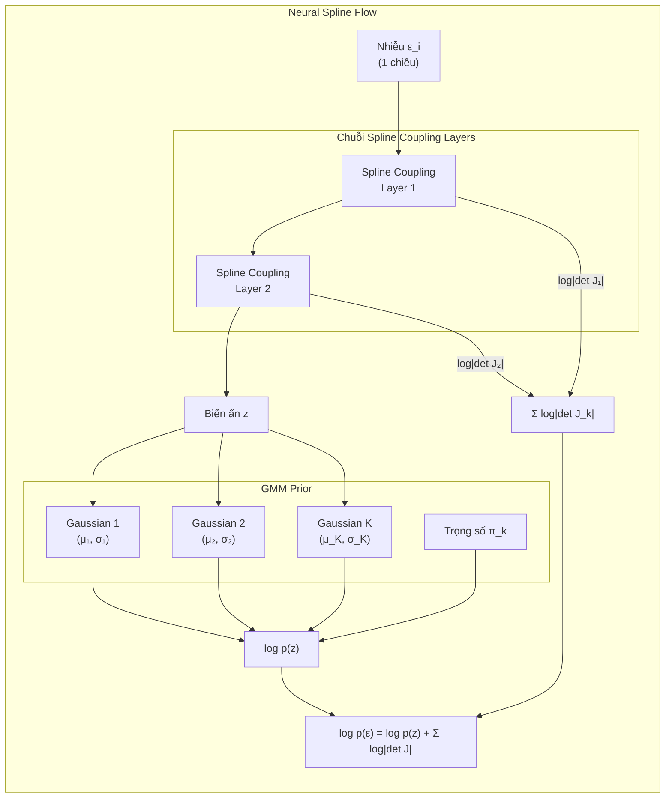
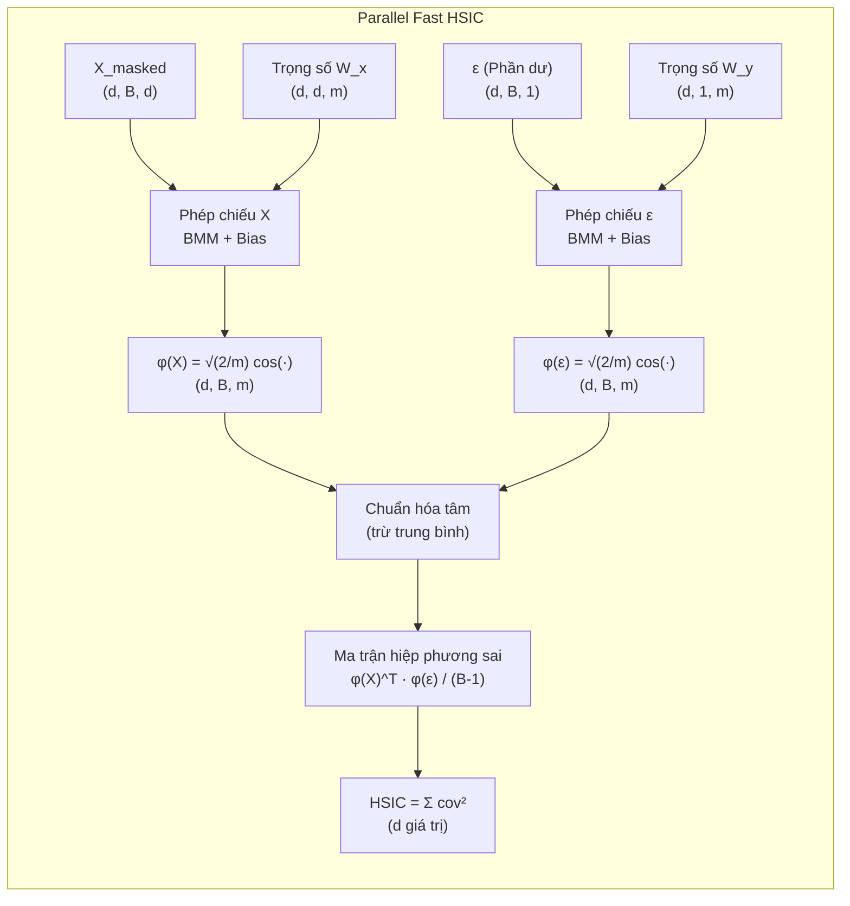
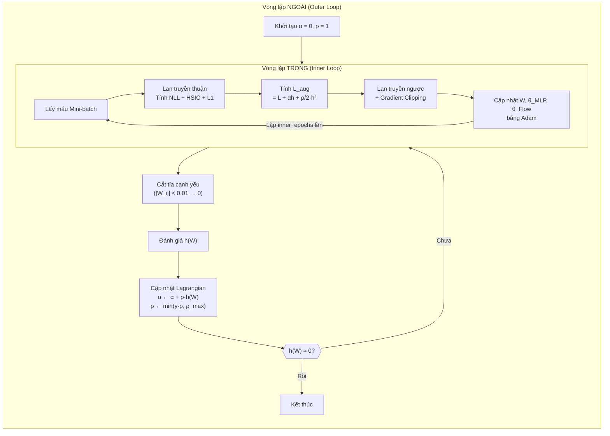
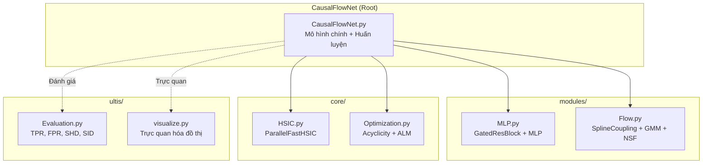

# CHƯƠNG 2: PHƯƠNG PHÁP ĐỀ XUẤT

Chương này trình bày toàn diện kiến trúc và quy trình hoạt động của mô hình **CausalFlowNet** — phương pháp cốt lõi được đề xuất trong đề tài. Dựa trên nền tảng lý thuyết đã xây dựng ở Chương 1, mô hình này kết hợp chặt chẽ các thành phần: mạng nơ-ron Gated Residual MLP, luồng chuẩn hóa Neural Spline Flow, kiểm định độc lập HSIC song song, và tối ưu hóa Augmented Lagrangian để giải quyết bài toán khám phá cấu trúc nhân quả phi tuyến tính từ dữ liệu quan sát. Các mục tiếp theo sẽ đi sâu vào từng thành phần, phân tích cách chúng phối hợp với nhau, và mô tả chi tiết quy trình huấn luyện cùng các phương pháp suy luận nhân quả sau huấn luyện.

---

## 2.1. Tổng quan Kiến trúc Mô hình

### 2.1.1. Ý tưởng Thiết kế

CausalFlowNet được xây dựng dựa trên quan điểm rằng bài toán khám phá nhân quả có thể được quy về bài toán **tối ưu hóa liên tục có ràng buộc**. Cụ thể, mô hình cần đồng thời thực hiện ba nhiệm vụ:

1. **Học cấu trúc đồ thị:** Tìm ra ma trận kề $W \in \mathbb{R}^{d \times d}$ biểu diễn quan hệ nhân quả giữa $d$ biến.
2. **Học cơ chế nhân quả:** Xấp xỉ các hàm cấu trúc $f_i$ trong SEM $X_i = f_i(PA_i, \epsilon_i)$ thông qua mạng nơ-ron.
3. **Mô hình hóa phân phối nhiễu:** Ước lượng mật độ xác suất của nhiễu $\epsilon_i$ bằng Normalizing Flow, thay vì giả định cứng về dạng phân phối.

Ba nhiệm vụ này được giải quyết đồng thời dưới ràng buộc $h(W) = 0$ (đảm bảo DAG), tạo nên một khung tối ưu hóa thống nhất end-to-end.

### 2.1.2. Sơ đồ Kiến trúc Tổng quát

Sơ đồ dưới đây minh họa dòng dữ liệu (data flow) qua các thành phần chính của CausalFlowNet:

### 2.1.3. Mô tả Dòng Dữ liệu

Quy trình xử lý dữ liệu qua CausalFlowNet diễn ra theo trình tự sau:

**Bước 1 – Chuẩn bị đầu vào song song:** Dữ liệu quan sát $X \in \mathbb{R}^{B \times d}$ (với $B$ là kích thước lô, $d$ là số biến) được nhân rộng thành $d$ bản sao. Mỗi bản sao thứ $i$ được nhân phần tử (element-wise) với hàng thứ $i$ của ma trận kề chuyển vị $W^T$. Kết quả là mỗi biến $X_i$ chỉ "nhìn thấy" các biến cha của nó theo cấu trúc đồ thị hiện tại.

**Bước 2 – Dự báo cơ chế cấu trúc:** Đầu vào đã lọc được đưa qua mạng Gated-ResMLP dùng chung (shared weights). Mạng này xuất ra giá trị dự báo $\hat{X}_i = f(PA_i; \theta)$ cho mỗi biến.

**Bước 3 – Tính phần dư (nhiễu):** Phần dư $\epsilon_i = X_i - \hat{X}_i$ được tính cho mỗi biến. Nếu cấu trúc nhân quả và hàm cơ chế đúng, phần dư này chính là nhiễu ngoại sinh độc lập.

**Bước 4 – Ước lượng mật độ nhiễu:** Phần dư được đưa qua Neural Spline Flow để tính log-likelihood. Flow sẽ ánh xạ $\epsilon_i$ về không gian ẩn $z$ và đánh giá mật độ xác suất thông qua GMM Prior.

**Bước 5 – Kiểm định độc lập:** Song song với bước 4, phần dư $\epsilon_i$ và đầu vào $X_{\text{masked}}$ được đưa vào khối HSIC song song để kiểm tra tính độc lập thống kê.

**Bước 6 – Tính hàm mất mát tổng hợp:** Kết hợp NLL, HSIC, chuẩn L1 và ràng buộc acyclicity thông qua Augmented Lagrangian để tạo thành hàm mất mát duy nhất.

**Bước 7 – Cập nhật tham số:** Lan truyền ngược (backpropagation) đồng thời cập nhật ma trận $W$, trọng số MLP và tham số Flow.

---

## 2.2. Khối Gated Residual MLP — Học Cơ chế Nhân quả

### 2.2.1. Vai trò trong Mô hình

Trong khung SEM $X_i = f_i(PA_i, \epsilon_i)$, hàm cấu trúc $f_i$ mô tả cách biến cha ảnh hưởng đến biến con. CausalFlowNet sử dụng một mạng **Gated Residual MLP** dùng chung cho tất cả $d$ biến (shared weights) để xấp xỉ hàm $f_i$ này. Việc dùng chung trọng số giúp:
- Giảm đáng kể số lượng tham số (từ $O(d \times p)$ xuống $O(p)$, với $p$ là số tham số của một MLP).
- Tăng hiệu quả sử dụng dữ liệu, đặc biệt khi số mẫu nhỏ hơn nhiều so với số biến.
- Cho phép vector hóa toàn bộ phép tính, tận dụng tối đa GPU.

### 2.2.2. Kiến trúc Chi tiết

Kiến trúc Gated-ResMLP trong CausalFlowNet bao gồm ba phần chính:

**Phần 1 – Lớp chiếu đầu vào (Input Projection):**

Dữ liệu đầu vào $x \in \mathbb{R}^d$ (đã được lọc qua mặt nạ) được chiếu lên không gian ẩn có chiều $h$ thông qua một lớp tuyến tính kèm hàm kích hoạt LeakyReLU:

$$ h_0 = \text{LeakyReLU}(W_{\text{proj}} \cdot x + b_{\text{proj}}) $$

Hàm LeakyReLU với hệ số âm $\alpha = 0.2$ được chọn thay vì ReLU tiêu chuẩn để tránh hiện tượng "nơ-ron chết" (dead neuron) — khi giá trị đầu vào âm bị triệt tiêu hoàn toàn.

**Phần 2 – Chuỗi các Khối Gated Residual:**

Phần lõi của mạng là chuỗi các khối Gated Residual Block xếp chồng. Mỗi khối thực hiện quy trình xử lý sau:

Chi tiết từng bước:

1. **Layer Normalization:** Chuẩn hóa phân phối tín hiệu đầu vào để ổn định quá trình huấn luyện. Khác với Batch Normalization, Layer Normalization hoạt động trên từng mẫu độc lập nên không phụ thuộc vào kích thước lô.

2. **Ánh xạ lên không gian gấp đôi:** Một lớp tuyến tính ánh xạ $h \in \mathbb{R}^d$ lên $\mathbb{R}^{2d}$, sau đó tách đều thành hai nửa:
   - **Features** ($\in \mathbb{R}^d$): Chứa thông tin đặc trưng.
   - **Gate** ($\in \mathbb{R}^d$): Tín hiệu điều khiển cổng.

3. **Cơ chế Gating:** Hai nửa được kết hợp theo công thức:

$$ h_{\text{gated}} = \text{LeakyReLU}(\text{features}) \circ \sigma(\text{gate}) $$

   Trong đó $\sigma$ là hàm Sigmoid ép giá trị cổng về khoảng $(0, 1)$. Mỗi chiều của vector đặc trưng được nhân với một hệ số cổng tương ứng, cho phép mô hình chủ động "bật" (giữ nguyên) hoặc "tắt" (triệt tiêu) từng tín hiệu riêng lẻ tùy theo ngữ cảnh dữ liệu.

4. **Chiếu đầu ra và Kết nối Residual:** Kết quả được chiếu lại về chiều ban đầu qua lớp tuyến tính, sau đó cộng trực tiếp với đầu vào gốc:

$$ h' = W_{\text{out}} \cdot h_{\text{gated}} + b_{\text{out}} + h $$

   Kết nối residual đảm bảo gradient luôn có "đường tắt" để lan truyền ngược, giải quyết triệt để vấn đề gradient vanishing.

**Phần 3 – Lớp dự báo cuối cùng (Output Layer):**

Lớp tuyến tính cuối cùng chiếu từ không gian ẩn $h$ xuống không gian đầu ra 1 chiều, cho ra giá trị dự báo $\hat{X}_i$ của mỗi biến:

$$ \hat{X}_i = W_{\text{final}} \cdot h_L + b_{\text{final}} $$

### 2.2.3. Khởi tạo Trọng số Trực giao

Tất cả các lớp tuyến tính trong Gated-ResMLP được khởi tạo bằng phương pháp **Orthogonal Initialization** với hệ số gain $= 1.4$. Phương pháp này tạo ra các ma trận trọng số có các hàng (hoặc cột) trực giao với nhau, giúp:
- Đảm bảo phổ (spectrum) của ma trận trọng số tập trung quanh giá trị 1, tránh hiện tượng gradient bùng nổ hoặc triệt tiêu.
- Tăng tốc quá trình hội tụ so với khởi tạo ngẫu nhiên thông thường (Xavier hoặc Kaiming).
- Hệ số gain $1.4$ được hiệu chỉnh cụ thể cho kiến trúc có cổng, bù đắp cho sự suy giảm biên độ tín hiệu khi đi qua hàm Sigmoid.

### 2.2.4. Cơ chế Mặt nạ và Chia sẻ Trọng số

Điểm thiết kế then chốt của CausalFlowNet là cách sử dụng **mặt nạ (mask)** từ ma trận kề $W$ để điều khiển dòng thông tin vào mạng MLP dùng chung:

$$ X_{\text{masked}}^{(i)} = X \circ W_{i,:}^T, \quad \forall i = 1, \dots, d $$

Trong đó $W_{i,:}^T$ là cột thứ $i$ của ma trận $W$ chuyển vị, đóng vai trò như một vector trọng số "mềm" (soft mask). Khác với mặt nạ nhị phân cứng (0 hoặc 1), mặt nạ mềm này cho phép:
- Gradient chảy ngược về $W$, giúp mô hình học cấu trúc đồ thị thông qua tối ưu hóa.
- Các trọng số $W_{ij}$ gần 0 tự động triệt tiêu ảnh hưởng của biến $X_j$ lên biến $X_i$.
- Toàn bộ quá trình diễn ra "vi phân được" (differentiable), phù hợp cho tối ưu hóa dựa trên gradient.

Ngoài ra, đường chéo chính của $W$ luôn được đặt bằng 0:

$$ W_{\text{clean}} = W \circ (1 - I_d) $$

Điều này loại bỏ hoàn toàn các vòng tự lặp (self-loops), đảm bảo biến $X_i$ không thể là nguyên nhân của chính nó.

---

## 2.3. Khối Neural Spline Flow — Mô hình hóa Phân phối Nhiễu

### 2.3.1. Vai trò trong Mô hình

Sau khi khối Gated-ResMLP dự báo giá trị kỳ vọng $\hat{X}_i$, phần dư (residual) được tính cho mỗi biến:

$$ \epsilon_i = X_i - \hat{X}_i $$

Phần dư $\epsilon_i$ chính là ước lượng của nhiễu ngoại sinh trong SEM. Thay vì giả định nhiễu tuân theo phân phối Gauss chuẩn — một giả định quá đơn giản cho dữ liệu thực tế — CausalFlowNet sử dụng **Neural Spline Flow** (NSF) để mô hình hóa phân phối nhiễu một cách linh hoạt và phi tham số.

NSF có khả năng:
- Ước lượng mật độ xác suất chính xác (exact density estimation) thay vì xấp xỉ.
- Xử lý phân phối nhiễu có hình dạng phức tạp: đa đỉnh, không đối xứng, đuôi nặng.
- Cung cấp giá trị log-likelihood chính xác, phục vụ trực tiếp cho hàm mất mát.

### 2.3.2. Kiến trúc Neural Spline Flow

NSF trong CausalFlowNet bao gồm ba thành phần chính:

**Thành phần 1 – Spline Coupling Layers:**

Mỗi lớp ghép (coupling layer) thực hiện phép biến đổi khả nghịch dựa trên hàm Rational-Quadratic Spline (RQS). Cơ chế hoạt động:

1. Đầu vào $x$ được chia thành hai phần theo mặt nạ nhị phân:
   - $x_{\text{static}}$: Phần giữ nguyên, dùng làm đầu vào để tạo tham số Spline.
   - $x_{\text{dynamic}}$: Phần được biến đổi.

2. Phần $x_{\text{static}}$ đi qua một mạng nơ-ron nhỏ (2 lớp tuyến tính) để sinh ra $3K + 1$ tham số cho mỗi chiều (với $K$ là số thùng):
   - $K$ giá trị độ rộng thùng (widths).
   - $K$ giá trị độ cao thùng (heights).
   - $K + 1$ giá trị đạo hàm tại biên thùng (derivatives).

3. Phần $x_{\text{dynamic}}$ được biến đổi bằng hàm RQS sử dụng các tham số trên. Phép biến đổi này là khả nghịch theo phân tích, cho phép tính log-determinant Jacobian chính xác.

4. Mặt nạ được xoay vòng (alternating masks) giữa các lớp để đảm bảo tất cả các chiều đều được biến đổi ít nhất một lần.

CausalFlowNet sử dụng mặc định **2 lớp ghép** (num_layers = 2) và **8 thùng** (num_bins = 8), đủ linh hoạt để nắm bắt các phân phối nhiễu phức tạp mà vẫn giữ được hiệu năng tính toán cao.

**Thành phần 2 – Cơ chế xử lý ngoài biên (Tail Handling):**

Các giá trị nằm ngoài biên $[-B_{\text{tail}}, B_{\text{tail}}]$ (mặc định $B_{\text{tail}} = 3.0$) được ánh xạ đồng nhất (identity mapping) mà không qua biến đổi Spline. Điều này đảm bảo:
- Tính ổn định số học khi gặp các giá trị ngoại lai (outliers).
- Log-determinant tại các điểm ngoài biên bằng 0, không ảnh hưởng đến tổng log-likelihood.

**Thành phần 3 – GMM Prior:**

Thay vì Gauss đơn $\mathcal{N}(0, 1)$, CausalFlowNet sử dụng phân phối ưu tiên GMM có thể học được với $K$ thành phần (mặc định $K = 5$):

$$ p(z) = \sum_{k=1}^K \pi_k \mathcal{N}(z | \mu_k, \sigma_k^2) $$

Trong đó các tham số $\pi_k$ (trọng số pha trộn), $\mu_k$ (trung bình) và $\sigma_k$ (độ lệch chuẩn) đều được học đồng thời với toàn bộ mô hình. Trọng số $\pi_k$ được chuẩn hóa qua hàm Softmax để đảm bảo $\sum_k \pi_k = 1$.

GMM Prior mang lại hai lợi ích quan trọng:
- **Ước lượng mật độ linh hoạt:** Hỗn hợp Gaussian có thể xấp xỉ bất kỳ phân phối liên tục nào (theo Định lý Xấp xỉ Universal).
- **Khả năng phân cụm tự nhiên:** Mỗi thành phần Gaussian có thể đại diện cho một "chế độ" (regime) khác nhau trong dữ liệu, phù hợp với dữ liệu sinh học nơi các tế bào có thể ở trong các trạng thái sinh lý khác nhau (ví dụ: tập Sachs với nhiều điều kiện thí nghiệm).

### 2.3.3. Tính Log-Likelihood

Giá trị log-likelihood cho mỗi mẫu nhiễu $\epsilon_i$ được tính theo công thức đổi biến:

$$ \log p(\epsilon_i) = \log p(z_i) + \sum_{k=1}^{K_{\text{layers}}} \log \left| \det J_k \right| $$

Trong đó:
- $z_i = f_{K} \circ \dots \circ f_1(\epsilon_i)$ là giá trị ẩn sau khi đi qua chuỗi biến đổi Spline.
- $\log p(z_i)$ là log-probability của $z_i$ theo GMM Prior (tính bằng LogSumExp trên $K$ thành phần).
- $\sum \log |det J_k|$ là tổng log-determinant Jacobian qua tất cả các lớp.

Hàm mất mát **Negative Log-Likelihood (NLL)** được tính bằng cách lấy trung bình âm log-likelihood qua tất cả $d$ biến và $B$ mẫu:

$$ \text{NLL}(W) = -\frac{1}{d} \sum_{i=1}^{d} \frac{1}{B} \sum_{b=1}^{B} \log p(\epsilon_i^{(b)}) $$

NLL thấp cho thấy mô hình đã tìm được cấu trúc nhân quả và hàm cơ chế phù hợp, sao cho phần dư có phân phối "sạch" và dễ mô hình hóa.

---

## 2.4. Khối HSIC Song song — Kiểm định Độc lập Thống kê

### 2.4.1. Vai trò trong Mô hình

Trong SEM, một điều kiện cần thiết để cấu trúc nhân quả là đúng: **nhiễu $\epsilon_i$ phải độc lập thống kê với các biến cha $PA_i$**. HSIC đóng vai trò là "bộ kiểm tra" tính đúng đắn này trong suốt quá trình huấn luyện.

Nếu mô hình chọn sai chiều nhân quả (ví dụ: $X_2 \rightarrow X_1$ thay vì $X_1 \rightarrow X_2$), thì phần dư sẽ **không** độc lập với các biến đầu vào, và HSIC sẽ phát ra giá trị cao, tạo hạng phạt lớn trong hàm mất mát. Nhờ vậy mô hình bị "ép" phải học đúng chiều nhân quả.

### 2.4.2. Kiến trúc Parallel Fast HSIC

CausalFlowNet triển khai HSIC theo phương pháp **song song hóa hoàn toàn** (fully parallelized), xử lý tất cả $d$ biến đồng thời trong một phép toán tensor duy nhất:

Quy trình xử lý chi tiết:

**Bước 1 – Ánh xạ vào không gian Fourier:**

Đặc trưng Fourier ngẫu nhiên (RFF) được tính cho cả đầu vào $X$ và phần dư $\epsilon$ đồng thời:

$$ \phi(x) = \sqrt{\frac{2}{m}} \cos(W_x^T x + b_x) $$

Trong đó $W_x \in \mathbb{R}^{d \times d \times m}$ là ma trận trọng số cố định (không học), được khởi tạo từ phân phối Gauss chuẩn. Bias $b_x \in \mathbb{R}^{d \times 1 \times m}$ được lấy mẫu từ phân phối đều $\text{Uniform}(0, 2\pi)$. Phép tính này sử dụng **Batch Matrix Multiplication (BMM)** để xử lý song song tất cả $d$ biến.

**Bước 2 – Chuẩn hóa tâm:**

Trừ giá trị trung bình theo chiều lô (batch) để đảm bảo các đặc trưng có trung bình bằng 0:

$$ \phi_{\text{centered}}(x) = \phi(x) - \frac{1}{B} \sum_{b=1}^B \phi(x^{(b)}) $$

**Bước 3 – Tính hiệp phương sai và HSIC:**

$$ \text{HSIC}(X_i, \epsilon_i) = \sum_{p,q} \left( \frac{\phi_x^T \phi_y}{B - 1} \right)_{p,q}^2 $$

Giá trị HSIC cho tất cả $d$ biến được tính song song, sau đó lấy trung bình Log-HSIC làm hạng phạt:

$$ L_{\text{HSIC}} = \frac{\lambda_{\text{HSIC}}}{d} \sum_{i=1}^d \log(\text{HSIC}_i + 10^{-8}) $$

Hằng số $10^{-8}$ đảm bảo ổn định số học khi HSIC tiến về 0.

### 2.4.3. Ưu điểm của Phương pháp Song song

So với cách tính HSIC tuần tự (lặp qua từng biến), phương pháp song song của CausalFlowNet có độ phức tạp:

| Phương pháp | Độ phức tạp thời gian | Tận dụng GPU |
|---|---|---|
| Tuần tự | $O(d \times B \times m)$ | Kém |
| **CausalFlowNet (Song song)** | **$O(B \times m)$** | **Tối đa** |

Bảng trên cho thấy phương pháp song song giảm thời gian tính toán đi $d$ lần (với $d$ là số biến), đồng thời tận dụng tối đa khả năng xử lý song song của GPU thông qua các phép toán tensor.

---

## 2.5. Khối Tối ưu hóa — Augmented Lagrangian

### 2.5.1. Phát biểu Bài toán Tối ưu

Toàn bộ quá trình huấn luyện CausalFlowNet được quy về bài toán tối ưu hóa có ràng buộc:

$$ \min_W L(W) = \text{NLL}(W) + \lambda_{\text{HSIC}} L_{\text{HSIC}}(W) + \lambda_{\text{L1}} \|W\|_1 $$

$$ \text{Điều kiện:} \quad h(W) = \text{Tr}(e^{W \circ W}) - d = 0 $$

Trong đó:
- **NLL(W):** Âm log-likelihood từ Neural Spline Flow — đo lường chất lượng mô hình hóa nhiễu.
- **$L_{\text{HSIC}}(W)$:** Hạng phạt HSIC — đảm bảo tính độc lập giữa nhiễu và biến cha.
- **$\|W\|_1$:** Chuẩn L1 của ma trận kề — khuyến khích đồ thị thưa (sparse), phản ánh giả định rằng đồ thị nhân quả thực tế thường chỉ có ít cạnh so với tổng số cạnh có thể.
- **$h(W) = 0$:** Ràng buộc acyclicity dạng liên tục theo NOTEARS.

### 2.5.2. Phương pháp Augmented Lagrangian

Ràng buộc $h(W) = 0$ được đưa vào hàm mục tiêu thông qua phương pháp Augmented Lagrangian:

$$ L_{\text{aug}}(W, \alpha, \rho) = L(W) + \alpha h(W) + \frac{\rho}{2} h(W)^2 $$

Phương pháp này hoạt động theo cơ chế **vòng lặp kép** (dual-loop):

**Vòng lặp trong (Inner Loop):** Với $\alpha$ và $\rho$ cố định, tối ưu hóa $L_{\text{aug}}$ bằng Adam optimizer. Mỗi bước bao gồm:
- Lấy mẫu mini-batch ngẫu nhiên kích thước $B$ (mặc định 512).
- Tính lan truyền thuận qua toàn bộ pipeline.
- Lan truyền ngược và cập nhật tham số.
- Áp dụng **Gradient Clipping** với giá trị tối đa 1.5 để ổn định huấn luyện.

**Vòng lặp ngoài (Outer Loop):** Sau mỗi $T$ vòng lặp trong (mặc định $T = 5$), thực hiện:
1. **Cắt tỉa cấu trúc (Structure Pruning):** Các cạnh có $|W_{ij}| < 0.01$ bị gán về 0.
2. **Đánh giá ràng buộc:** Tính $h(W)$ trên tập mẫu đại diện (1000 mẫu).
3. **Cập nhật tham số Lagrangian:**

$$ \alpha \leftarrow \alpha + \rho \cdot h(W) $$
$$ \rho \leftarrow \min(\gamma \cdot \rho, \rho_{\text{max}}) $$

   Với hệ số tăng trưởng $\gamma = 5.0$ và giới hạn trên $\rho_{\text{max}} = 10^{10}$.

### 2.5.3. Giải thích Trực giác

Quá trình tối ưu hóa có thể hình dung như sau:
- **Nhân tử $\alpha$** đóng vai trò "bộ nhớ": nếu ràng buộc bị vi phạm nhiều lần liên tiếp, $\alpha$ tăng dần, tạo áp lực ngày càng lớn để mô hình hướng tới không gian DAG.
- **Tham số phạt $\rho$** đóng vai trò "độ nghiêm khắc": $\rho$ tăng theo cấp số nhân qua mỗi vòng ngoài, khiến chi phí vi phạm ràng buộc ngày càng đắt đỏ.
- Kết hợp cả hai, mô hình ban đầu được "thả lỏng" để tự do khám phá không gian tham số, sau đó dần bị "siết chặt" về vùng DAG hợp lệ.

---

## 2.6. Quy trình Huấn luyện Tổng thể

### 2.6.1. Các Siêu tham số

Bảng dưới đây tóm tắt các siêu tham số mặc định và ý nghĩa của chúng:

| Siêu tham số | Ký hiệu | Giá trị mặc định | Ý nghĩa |
|---|---|---|---|
| Số biến | $d$ | Tùy dữ liệu | Số nút trong đồ thị nhân quả |
| Chiều ẩn MLP | hidden_dims | [32, 32] | Kích thước các lớp ẩn trong Gated-ResMLP |
| Số thùng Spline | num_bins | 8 | Độ phân giải của hàm RQS |
| Số lớp Flow | num_layers | 2 | Độ sâu của chuỗi biến đổi |
| Số cụm GMM | $K$ | 5 | Số thành phần trong phân phối ưu tiên |
| Số đặc trưng RFF | $m$ | 32 | Kích thước xấp xỉ Fourier cho HSIC |
| Trọng số HSIC | $\lambda_{\text{HSIC}}$ | 0.01 | Mức độ phạt HSIC |
| Trọng số L1 | $\lambda_{\text{L1}}$ | 0.005 | Mức độ phạt tính thưa |
| Tốc độ học | lr | 0.01 | Learning rate cho Adam optimizer |
| Kích thước lô | $B$ | 512 | Số mẫu mỗi mini-batch |
| Vòng ngoài | outer_epochs | 15 | Số lần cập nhật Lagrangian |
| Vòng trong | inner_epochs | 100 | Số bước tối ưu mỗi vòng ngoài |
| Giới hạn gradient | clip_grad | 1.5 | Ngưỡng gradient clipping |
| $\rho$ khởi tạo | $\rho_0$ | 1.0 | Giá trị phạt ban đầu |
| Hệ số tăng $\rho$ | $\gamma$ | 5.0 | Tốc độ tăng tham số phạt |
| Ngưỡng cắt tỉa | $\tau_{\text{prune}}$ | 0.01 | Loại bỏ cạnh yếu |

### 2.6.2. Thuật toán Huấn luyện

Toàn bộ quy trình huấn luyện CausalFlowNet được tóm tắt trong thuật toán dưới đây:

---

**Thuật toán: Huấn luyện CausalFlowNet**

**Đầu vào:** Dữ liệu quan sát $X \in \mathbb{R}^{N \times d}$

**Đầu ra:** Ma trận kề DAG $\hat{W} \in \{0, 1\}^{d \times d}$

1. Khởi tạo $W$ ngẫu nhiên (Gauss, $\sigma = 0.05$), $\alpha = 0$, $\rho = 1.0$
2. **for** $t = 1$ to $T_{\text{outer}}$ **do:**
3. $\quad$ **for** $s = 1$ to $T_{\text{inner}}$ **do:**
4. $\quad\quad$ Lấy mẫu mini-batch $X_B$ kích thước $B$
5. $\quad\quad$ Tính $X_{\text{masked}} = X_B \circ W^T$ (lọc biến cha)
6. $\quad\quad$ $\hat{X} = \text{GatedResMLP}(X_{\text{masked}})$ (dự báo)
7. $\quad\quad$ $\epsilon = X_B - \hat{X}$ (tính phần dư)
8. $\quad\quad$ $\text{NLL} = -\text{mean}(\log p_{\text{NSF}}(\epsilon))$
9. $\quad\quad$ $L_{\text{HSIC}} = \lambda \cdot \text{mean}(\log(\text{HSIC}(X_{\text{masked}}, \epsilon)))$
10. $\quad\quad$ $L_{\text{L1}} = \lambda_{\text{L1}} \|W_{\text{clean}}\|_1 / d$
11. $\quad\quad$ $h = \text{Tr}(e^{W \circ W}) - d$
12. $\quad\quad$ $L_{\text{aug}} = (\text{NLL} + L_{\text{HSIC}} + L_{\text{L1}}) + \alpha h + \frac{\rho}{2} h^2$
13. $\quad\quad$ Lan truyền ngược $L_{\text{aug}}$, clip gradient, cập nhật bằng Adam
14. $\quad$ **end for**
15. $\quad$ **if** $t \mod 5 = 0$: Cắt tỉa $W_{ij} = 0$ nếu $|W_{ij}| < 0.01$
16. $\quad$ Đánh giá $h(W)$ trên 1000 mẫu
17. $\quad$ $\alpha \leftarrow \alpha + \rho \cdot h(W)$, $\rho \leftarrow \min(\gamma \rho, \rho_{\text{max}})$
18. **end for**
19. Cắt ngưỡng: $\hat{W}_{ij} = \mathbb{1}[|W_{ij}| > \tau]$
20. **return** $\hat{W}$

---

## 2.7. Suy luận Nhân quả Sau Huấn luyện

Sau khi mô hình hội tụ và trả về ma trận kề $\hat{W}$, CausalFlowNet cung cấp hai phương pháp suy luận nhân quả:

### 2.7.1. Phân cụm trong Không gian Nhân quả

Phương pháp `predict_clusters` sử dụng phần dư $\epsilon$ (nhiễu ước lượng) để nhận diện các nhóm con trong dữ liệu:

1. Cố định cấu trúc đồ thị $\hat{W}$ đã học.
2. Tính phần dư $\epsilon_i$ cho mỗi biến sử dụng Gated-ResMLP.
3. Ghép phần dư của tất cả biến thành vector ẩn $Z = [\epsilon_1, \dots, \epsilon_d] \in \mathbb{R}^{N \times d}$.
4. Áp dụng thuật toán K-Means trên không gian $Z$ để phân cụm.

Ý nghĩa: Các mẫu có nhiễu tương tự nhau thuộc cùng một "chế độ vận hành" (operating regime). Trong dữ liệu sinh học (ví dụ: tập Sachs), điều này có thể tương ứng với các điều kiện thí nghiệm khác nhau hoặc các trạng thái tế bào khác nhau.

### 2.7.2. Ước lượng Hiệu ứng Can thiệp Trung bình (ATE)

Phương pháp `estimate_ate` lượng hóa tác động nhân quả giữa hai biến bằng cách mô phỏng can thiệp $do(X_s = v)$:

1. Sao chép dữ liệu quan sát $X$.
2. Gán giá trị can thiệp: $X_{\text{int}}[:, s] = v$ cho biến nguồn $s$.
3. Tính giá trị dự báo tại biến đích $t$ dựa trên cấu trúc $\hat{W}$: $E[X_t | do(X_s = v)]$.
4. Lặp lại với các giá trị can thiệp khác nhau (mặc định: $v = 0$ và $v = 1$).
5. Tính ATE:

$$ \text{ATE}(s \rightarrow t) = E[X_t | do(X_s = 1)] - E[X_t | do(X_s = 0)] $$

ATE dương cho thấy tăng biến nguồn sẽ làm tăng biến đích; ATE âm cho thấy tác động ngược lại; ATE gần 0 cho thấy không có mối quan hệ nhân quả đáng kể.

---

## 2.8. Sơ đồ Cấu trúc Thư mục Mã nguồn

Mã nguồn của CausalFlowNet được tổ chức thành ba tầng rõ ràng:

| Thư mục | File | Chức năng |
|---|---|---|
| Root | CausalFlowNet.py | Lớp mô hình chính, vòng lặp huấn luyện, suy luận ATE và phân cụm |
| modules/ | MLP.py | GatedResBlock và Gated-ResMLP |
| modules/ | Flow.py | RQS, SplineCouplingLayer, GaussianMixturePrior, NeuralSplineFlow |
| core/ | HSIC.py | ParallelFastHSIC với Random Fourier Features |
| core/ | Optimization.py | Hàm h(W) và lớp AugmentedLagrangian |
| ultis/ | Evaluation.py | Tính TPR, FPR, SHD, SID |

---

## 2.9. Tiểu kết Chương 2

Chương này đã trình bày toàn diện phương pháp đề xuất CausalFlowNet với các đóng góp chính: (1) Kiến trúc Gated-ResMLP dùng chung trọng số cho phép học cơ chế nhân quả phi tuyến hiệu quả; (2) Neural Spline Flow với GMM Prior mô hình hóa phân phối nhiễu linh hoạt, không cần giả định phân phối; (3) Parallel Fast HSIC với Random Fourier Features giúp kiểm định độc lập thống kê ở tốc độ cao; (4) Augmented Lagrangian đảm bảo đồ thị học được hội tụ về cấu trúc DAG hợp lệ. Toàn bộ mô hình được huấn luyện end-to-end bằng gradient descent, cho phép đồng thời tối ưu hóa cả cấu trúc đồ thị lẫn các hàm cơ chế. Chương 3 sẽ trình bày kết quả thực nghiệm trên các tập dữ liệu chuẩn để đánh giá hiệu quả của phương pháp.
