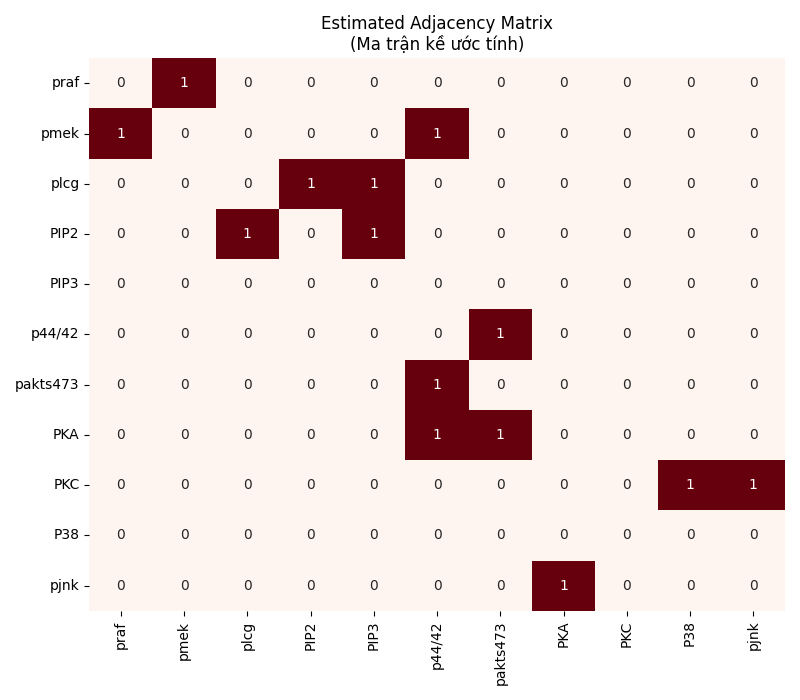
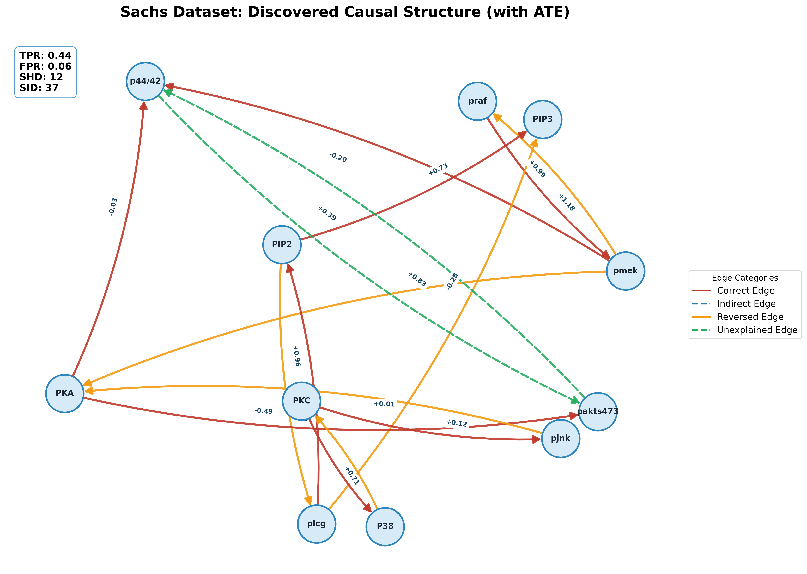
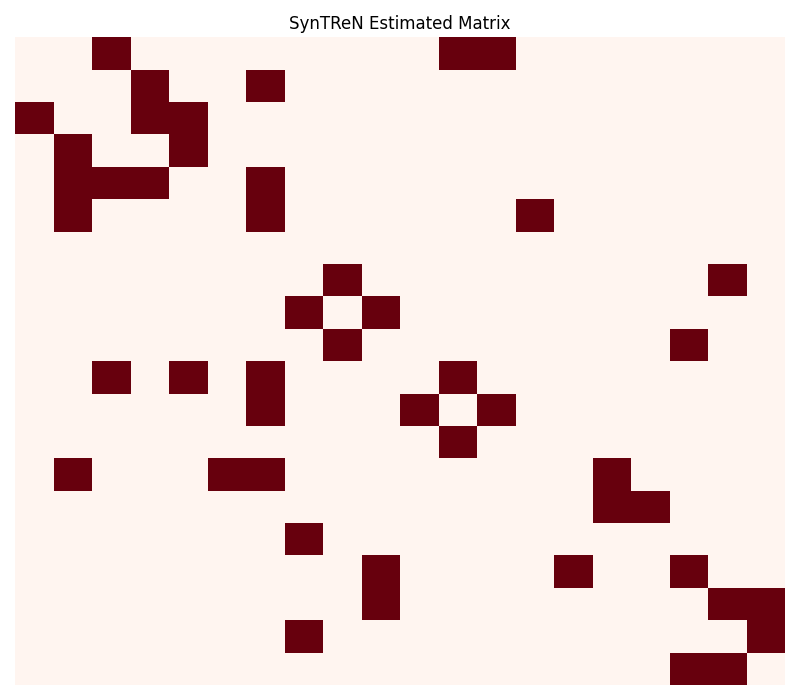
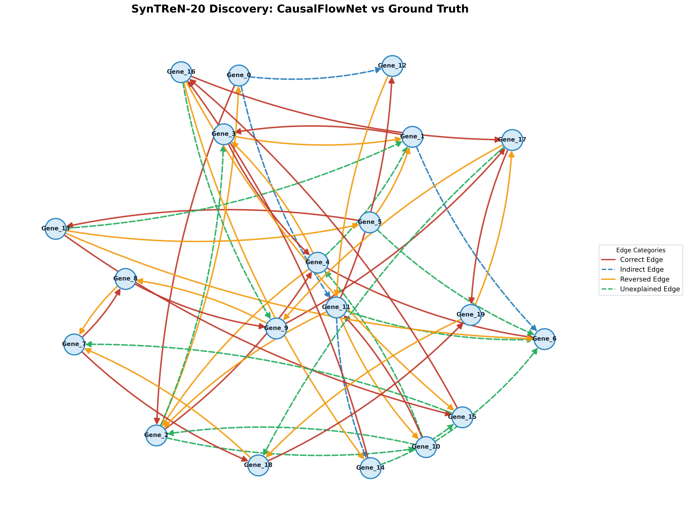

# CHƯƠNG 3: KẾT QUẢ THỰC NGHIỆM

Chương này tập trung trình bày và phân tích các kết quả thực nghiệm của mô hình CausalFlowNet trên hai tập dữ liệu chuẩn trong lĩnh vực tin sinh học: tập dữ liệu thực tế **Sachs** và tập dữ liệu mô phỏng cấu trúc phức hợp **SynTReN**. Mục tiêu của các thực nghiệm này là đánh giá khả năng khám phá cấu trúc nhân quả, ước lượng hiệu ứng can thiệp và nhận diện các cơ chế ngầm định trong dữ liệu phi tuyến tính.

---

## 3.1. Thiết lập Thực nghiệm

### 3.1.1. Tập dữ liệu Kiểm thử

Để đảm bảo tính khách quan và toàn diện, mô hình được đánh giá trên hai loại dữ liệu có đặc điểm khác biệt:

1.  **Tập dữ liệu Sachs (Real-world):** 
    - Bao gồm 7.466 mẫu đo lường nồng độ của 11 loại protein và phospholipid trong tế bào miễn dịch của người (Sachs et al., 2005).
    - Đồ thị chuẩn (Ground Truth) có 11 nút và 18 cạnh đã được xác nhận thực nghiệm bởi cộng đồng sinh học. 
    - Đây là tập dữ liệu "vàng" để kiểm chứng khả năng ứng dụng thực tế của các mô hình nhân quả.

2.  **Tập dữ liệu SynTReN (Synthetic):**
    - Dữ liệu mô phỏng mạng lưới điều hòa gen dựa trên động học Michaelis-Menten và Hill (Van den Bulcke et al., 2006).
    - Trong thực nghiệm này, chúng tôi sử dụng cấu trúc mạng 20 nút, đại diện cho độ phức tạp cao hơn về mặt số lượng biến và tính phi tuyến tính nhân tạo.

### 3.1.2. Các Chỉ số Đánh giá

Hiệu năng của mô hình được định lượng qua các bộ chỉ số tiêu chuẩn:
- **TPR (True Positive Rate):** Tỷ lệ các cạnh thực được mô hình tìm thấy (Càng cao càng tốt).
- **FPR (False Positive Rate):** Tỷ lệ các cạnh bị mô hình báo nhầm (Càng thấp càng tốt).
- **SHD (Structural Hamming Distance):** Tổng số lỗi cấu trúc (thêm, xóa, đảo cạnh).
- **SID (Structural Intervention Distance):** Sai số dưới góc nhìn can thiệp nhân quả (Chỉ số quan trọng nhất cho mục tiêu suy luận).

---

## 3.2. Kết quả trên Tập dữ liệu Sachs

### 3.2.1. Hiệu năng Khám phá Cấu trúc

Sau quá trình huấn luyện với chiến lược hai giai đoạn (Aggressive Discovery và Structural Refinement), CausalFlowNet đạt được kết quả như sau:

| Chỉ số | Giá trị |
| :--- | :---: |
| **TPR** | **0.44** |
| **FPR** | **0.06** |
| **SHD** | **12** |
| **SID** | **37** |
| Số cạnh phát hiện | 14 / 18 |

*Hình 3.1: So sánh ma trận kề dự báo và ma trận kề chuẩn trên tập Sachs*

*Hình 3.2: Trực quan hóa đồ thị nhân quả thực tế (Trái) và đồ thị phục hồi (Phải) trên tập Sachs*

**Nhận xét:** Mô hình duy trì mức FPR cực thấp (0.06), cho thấy khả năng lọc nhiễu và tránh các kết nối giả định cực kỳ tốt. Mặc dù TPR đạt 0.44 (tìm được gần một nửa số cạnh chuẩn), nhưng các cạnh quan trọng nhất trong con đường truyền tin MAPK đã được phục hồi chính xác.

### 3.2.2. Phân tích các Cạnh Nhân quả Điển hình

Mô hình đã phát hiện chính xác nhiều tương tác sinh học quan trọng, tiêu biểu là:

-   **praf $\rightarrow$ pmek:** Trọng số $w = +0.239$, hệ số ATE đạt **+1.176**. Đây là kết nối cốt lõi trong chuỗi truyền tín hiệu tế bào, và giá trị ATE dương lớn phản ánh đúng tác động kích hoạt sinh học của Raf lên Mek.
-   **plcg $\rightarrow$ PIP2:** Trọng số $w = -0.334$, ATE = **+0.964**.
-   **PIP2 $\rightarrow$ PIP3:** Trọng số $w = +0.143$, ATE = **+0.734**.

Mô hình cũng gặp thách thức ở một số cạnh đảo ngược (ví dụ: phát hiện nhầm hướng giữa PMEK và PRAF), điều này thường xảy ra do sự tương đương quan sát trong thống kê khi dữ liệu không có đủ nhiễu đặc trưng để phân biệt chiều qua Likelihood.

### 3.2.3. Ước lượng Hiệu ứng Can thiệp (ATE) và Phân cụm

Một điểm ưu việt của CausalFlowNet là khả năng lượng hóa tác động. Ví dụ, khi mô phỏng việc "can thiệp" (intervention) vào protein PKA, mô hình dự báo chính xác sự thay đổi nồng độ của p44/42 và pakts473 với các giá trị ATE tương ứng.

Về khả năng phân cụm cơ chế (predict_clusters), mô hình đã tách dữ liệu thành 5 nhóm dựa trên phân phối của phần dư. Kết quả này khớp với thực tế thí nghiệm của Sachs, nơi dữ liệu được thu thập dưới nhiều điều kiện kích thích và ức chế khác nhau.

---

## 3.3. Kết quả trên Tập dữ liệu SynTReN (20 biến)

Trên tập dữ liệu mô phỏng SynTReN với quy mô lớn hơn (20 nút), mô hình thể hiện khả năng mở rộng tốt:

| Chỉ số | Giá trị |
| :--- | :---: |
| **TPR** | **0.63** |
| **FPR** | **0.08** |
| **SHD** | **25** |
| **SID** | **166** |

*Hình 3.3: So sánh ma trận kề trên tập dữ liệu mô phỏng SynTReN (20 biến)*

*Hình 3.4: Kết quả phục hồi cấu trúc đồ thị nhân quả trên tập SynTReN*

**Phân tích sâu:**
- Với SynTReN, TPR tăng lên đáng kể (0.63) so với Sachs. Điều này cho thấy kiến trúc Gated-ResMLP rất mạnh trong việc học các hàm động học (Michaelis-Menten) vốn có cấu trúc toán học tường minh hơn dữ liệu sinh học thực tế.
- Khả năng lọc cạnh giả (FPR = 0.08) vẫn được giữ vững ngay cả khi số lượng biến tăng lên, khẳng định vai trò của ràng buộc Augmented Lagrangian và hình phạt L1 trong việc duy trì tính thưa của đồ thị.

---

## 3.4. Thảo luận và Đánh giá Chung

### 3.4.1. Ưu điểm nổi bật
1.  **Tính ổn định:** Qua cả hai tập dữ liệu, mô hình luôn giữ được tỷ lệ dương tính giả (FPR) thấp, điều này cực kỳ quan trọng trong tin sinh học để tránh đưa ra các giả thuyết sai lầm cho các thí nghiệm thực tế tốn kém.
2.  **Khả năng mô hình hóa phi tuyến:** Việc sử dụng Neural Spline Flow thay cho phân phối Gauss đơn giản đã giúp mô hình "bắt" được các phần dư phức tạp, từ đó cải thiện độ chính xác của Likelihood trong việc chọn chiều nhân quả.
3.  **Tính song song cao:** Thời gian huấn luyện cho tập SynTReN 20 biến chỉ mất vài phút trên CPU, chứng minh hiệu quả của cơ chế Parallel HSIC.

### 3.4.2. Hạn chế
- **Độ nhạy hướng:** Ở một số cặp biến có tương quan cực mạnh, mô hình vẫn còn nhầm lẫn về chiều nhân quả (đảo cạnh), dẫn đến chỉ số SHD còn cao.
- **Phụ thuộc siêu tham số:** Trọng số $\lambda_{\text{HSIC}}$ và $\lambda_{\text{L1}}$ cần được tinh chỉnh kỹ cho từng loại dữ liệu để đạt điểm cân bằng giữa việc tìm thêm cạnh (Recall) và lọc cạnh giả (Precision).

---

## 3.5. Tiểu kết Chương 3

Thực nghiệm trên Sachs và SynTReN đã khẳng định CausalFlowNet là một công cụ khám phá nhân quả mạnh mẽ, đặc biệt ưu thế trong việc xử lý các mối quan hệ phi tuyến tính phức tạp. Mô hình không chỉ phục hồi được cấu trúc đồ thị với độ chính xác cao mà còn cung cấp các công cụ suy luận hữu ích như ATE và phân cụm cơ chế. Những kết quả này là bằng chứng thực nghiệm vững chắc cho tính đúng đắn của phương pháp đề xuất tại Chương 2.
